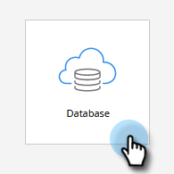
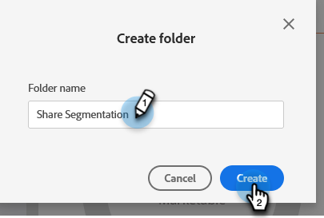
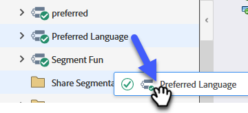

# Grundlegendes zu Arbeitsbereichen und Personen-Partitionen&#x200B; {#understanding-workspaces-and-person-partitions}

## Arbeitsbereiche {#workspaces}

>[!CAUTION]
>
>Die Einrichtung von Arbeitsbereichen kann komplex sein. Wenden Sie sich an den [Marketo](https://nation.marketo.com/t5/support/ct-p/Support?profile.language=de)Support, um herauszufinden, ob er für Sie geeignet ist.

Arbeitsbereiche sind separate Bereiche in Marketo, die Marketing-Assets wie Programme, Landingpages, E-Mails und mehr enthalten. Sie können von mehreren Personen verwendet werden. Jede Benutzerin und jeder Benutzer hat Zugriff auf einen oder mehrere Arbeitsbereiche.

>[!NOTE]
>
>**Beispiel**
>
>Einige Gründe für die Verwendung eines Arbeitsbereichs:
>
>* Geografie: Marketing-Abteilungen in Europa, Asien und Nordamerika erhalten jeweils einen Arbeitsbereich
>* Geschäftseinheit: [!DNL Quicken], [!DNL Quickbooks] und [!DNL TurboTax] erhalten jeweils einen Arbeitsbereich
>
>Eine Trennung ist in jedem Fall notwendig, wenn die Marketing-Assets völlig unterschiedlich sind. Wenn sie jedoch dieselben Marketing-Assets nutzen, sind Arbeitsbereiche möglicherweise nicht das richtige Tool für Sie.

>[!NOTE]
>
>Erfahren Sie, wie [einen neuen Arbeitsbereich erstellen](/help/marketo/product-docs/administration/workspaces-and-person-partitions/create-a-new-workspace.md).

## Freigeben über Arbeitsbereiche hinweg {#sharing-across-workspaces}

In den folgenden Schritten wird erläutert, wie Assets in Arbeitsbereichen freigegeben werden. Die Freigabe funktioniert für alle Assets gleich. Dieses Beispiel behandelt Segmentierungen.

>[!NOTE]
>
>Der übergeordnete Ordner mit den Assets ist der einzige Ordner, der freigegeben werden kann. Die untergeordneten Ordner/Elemente können nicht freigegeben werden.

1. Klicken Sie auf **[!UICONTROL Datenbank]**.

   

1. Klicken Sie mit der rechten Maustaste auf den Ordner „Segmentierung“ und klicken Sie dann auf **[!UICONTROL Neuer Ordner]**.

   

1. Benennen Sie den Ordner und klicken Sie auf **[!UICONTROL Erstellen]**.

   

1. Verschieben Sie die freizugebenden Asset(s) in den Ordner.

   

1. Klicken Sie mit der rechten Maustaste auf den Ordner und wählen Sie **[!UICONTROL Ordner freigeben]** aus.

   

1. Wählen Sie die Arbeitsbereiche aus, für die Sie den Ordner freigeben möchten, und klicken Sie auf **[!UICONTROL Speichern]**. Im Dialogfeld „Ordner freigeben“ werden nur Arbeitsbereiche angezeigt, für die Sie eine Berechtigung zur Anzeige haben.

   

   >[!NOTE]
   >
   >Der Ausgangsordner weist jetzt einen kleinen grünen Pfeil auf, der anzeigt, dass er freigegeben wurde. Am im Arbeitsbereich freigegebenen Ordner wird ein Vorhängeschloss angezeigt, das darauf hinweist, dass der Ordner schreibgeschützt ist.

Sie können diese Elemente über Arbeitsbereiche hinweg freigeben.

* E-Mail-Vorlagen
* Landingpage-Vorlagen
* Modelle
* Intelligente Kampagnen
* [Intelligente Listen](/help/marketo/product-docs/core-marketo-concepts/smart-lists-and-static-lists/using-smart-lists/reference-a-list-or-smart-list-across-workspaces.md)
* [Segmentierungen](/help/marketo/product-docs/administration/workspaces-and-person-partitions/share-segmentations-across-workspaces-and-partitions.md)
* Ausschnitte

## Klonen über Arbeitsbereiche hinweg {#cloning-across-workspaces}

Für Assets, die keine Vorlagen sind, wird empfohlen, sie als lokale Assets innerhalb eines Programms zu klonen. Über die richtige Zugriffsebene können Sie diese Assets per Drag-and-Drop in einen anderen Arbeitsbereich ziehen:

* Programme
* E-Mails
* Landingpages
* Formulare

>[!IMPORTANT]
>
>Alle oben aufgeführten Elemente können über Arbeitsbereiche hinweg geklont werden. E-Mails, Formulare und Landingpages müssen sich zum Zeitpunkt des Klonens jedoch _in einem Programm befinden_.

>[!NOTE]
>
>Beim Klonen von Assets mit Vorlagen müssen diese Vorlagen für den Zielarbeitsbereich freigegeben sein.

## Verschieben von Assets in andere Arbeitsbereiche {#moving-assets-to-other-workspaces}

Um Assets in einen neuen Arbeitsbereich zu verschieben, legen Sie sie in einem Ordner ab und ziehen Sie den Ordner in den anderen Arbeitsbereich.

>[!NOTE]
>
>Ein Programm, das Mitglieder enthält, kann nicht von einem Arbeitsbereich in einen anderen verschoben werden.

## Personen-Partitionen {#person-partitions}

Personen-Partitionen funktionieren wie separate Datenbanken. Jede Partition enthält ihre eigenen Personen, die nicht dedupliziert oder mit anderen Partitionen vermischt werden. Wenn für Ihren geschäftlichen Anwendungsfall doppelte Einträge mit derselben E-Mail-Adresse erforderlich sind, wenden Sie sich an den [Marketo-Support](https://nation.marketo.com/t5/support/ct-p/Support?profile.language=de).

Sie können Personen-Partitionen [Arbeitsbereichen](create-a-new-workspace.md) in den folgenden Konfigurationen zuweisen:

* 1:1-Partition (1:1)
* ein Arbeitsbereich für viele Personen-Partitionen (1:x)
* Viele Arbeitsbereiche zu einer Personenpartition (x:1)

>[!NOTE]
>
>Gründe für die Verwendung einer Personen-Partition:
>
>* Ihre Arbeitsbereiche verfügen nicht nur über verschiedene Assets, sondern geben auch keine Personen frei
>* Duplikate werden aus anderen geschäftlichen Gründen gewünscht

>[!CAUTION]
>
>Personen-Partitionen interagieren nicht miteinander, daher sollten Sie bei der Einrichtung sorgfältig vorgehen.

>[!NOTE]
>
>Erfahren Sie, wie Sie [eine Personen-Partition erstellen](/help/marketo/product-docs/administration/workspaces-and-person-partitions/create-a-person-partition.md).
