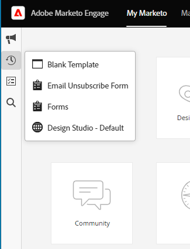

# Adobe Experience Cloud-Benutzeroberfläche – Übersicht {#adobe-experience-cloud-interface-overview}

Die Adobe Experience Cloud-Oberfläche passt sich dem „Shell”-Look-and-Feel der Adobe Experience Cloud-Anwendungen und -Dienste an. Aber sie weist mehr als nur ein neues Design auf. Es handelt sich dabei um eine Single Page Application, die das Anwendererlebnis in einer einzigen Instanz bereitstellt.

## Benutzerfluss {#user-flow}

Wenn Sie noch nicht bei einem Adobe Experience Cloud-Produkt angemeldet sind, melden Sie sich hier direkt bei [!DNL Marketo Engage] an: [https://experience.adobe.com/marketo-engage](https://experience.adobe.com/marketo-engage).

Wenn Sie bereits bei einem Adobe Experience Cloud-Produkt _angemeldet_ sind, klicken Sie einfach auf das Menüsymbol und wählen Sie **[!DNL Marketo Engage]** aus.

>[!NOTE]
>
>Je nachdem, welche Adobe Experience Cloud-Produkte Sie abonniert haben, kann Ihr Dropdown-Menü unterschiedlich aussehen.

## Neue Funktionen {#new-features}

Neben dem aktualisierten Look-and-Feel werden Ihnen die folgenden Funktionen auffallen:

**Integriertes Hilfezentrum**

Greifen Sie über das [!DNL Marketo Engage]-Programm auf eine Vielzahl verfügbarer Hilferessourcen zu.

**Programmumschalter**

Benutzende mit Zugriff auf verschiedene Adobe-Produkte können damit problemlos zwischen ihnen wechseln.

**Benachrichtigungen und Ankündigungen**

Zeigen Sie produktspezifische Benachrichtigungen und allgemeine Adobe-Produktankündigungen direkt in der Anwendung an und interagieren Sie mit ihnen.

**Adobe-Einstellungen**

Klicken Sie auf das Profilsymbol, um Ihre Sprache oder andere Einstellungen für alle Adobe-Produkte zu ändern.

## FAQs {#faq}

**Ich kann mich nicht über die Experience Cloud-Benutzeroberfläche bei [!DNL Marketo Engage] anmelden. Was könnte das Problem sein?**

Wenn Sie sich bei Adobe Experience Cloud anmelden können, aber dann den Fehler „Fehler beim Laden der Seite“ sehen, könnte das Problem aufseiten von [!DNL Marketo Engage] liegen. Wenden Sie sich an den [Marketo-Support](https://nation.marketo.com/t5/support/ct-p/Support), wenn Sie Unterstützung benötigen.

**Wo sind der Benutzerverlauf, die globale Suche, die Marketo-Benachrichtigungen und der Task-Tray geblieben?**

Diese Funktionen wurden von der oberen Navigationsleiste in eine neue Leiste auf der linken Seite der Experience Cloud-Benutzeroberfläche verschoben.

