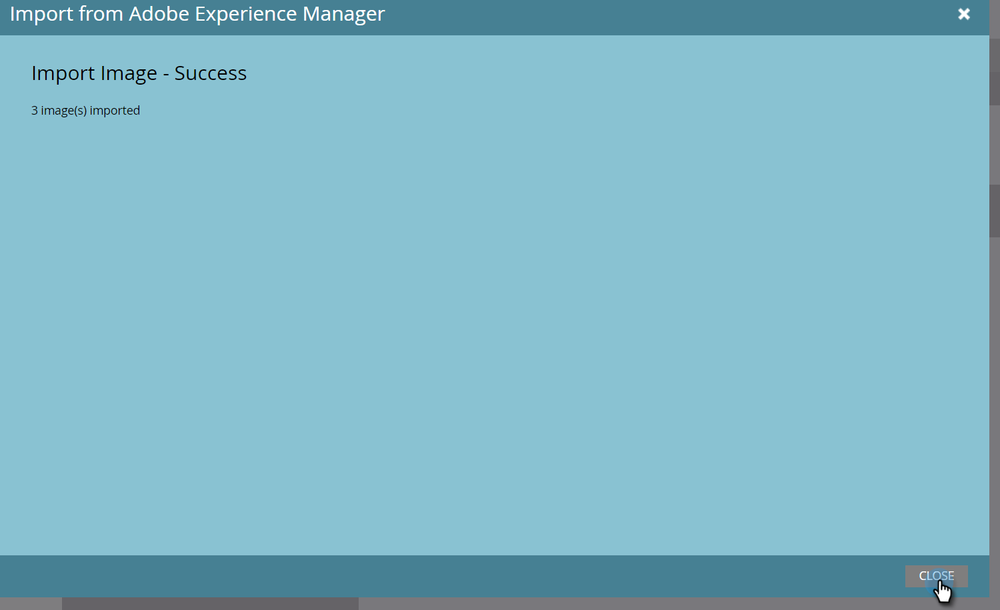

# Importieren von Assets mit Adobe Experience Manager {#importing-assets-with-adobe-experience-manager}

Mit der Asset-Auswahl können Marketo-Kunden auf AEM Assets zugreifen, sie auswählen und in die Marketo importieren. [!DNL Design Studio] **Administratorberechtigungen sind erforderlich**.

>[!AVAILABILITY]
>
>Nicht jeder hat diese Funktion erworben. Weitere Informationen erhalten Sie vom Adobe Account Team (Ihrem Kundenbetreuer).

>[!PREREQUISITES]
>
>Stellen Sie sicher, dass Sie die [AEM Konfiguration](/help/marketo/product-docs/core-marketo-concepts/miscellaneous/configuring-adobe-experience-manager-integration.md) bereits ausgeführt haben.

>[!IMPORTANT]
>
>Diese Funktion wird derzeit nur in [!DNL Firefox] vollständig unterstützt. Sie wird in [!DNL Safari] nicht unterstützt und funktioniert möglicherweise nicht in der neuesten Version von [!DNL Chrome], je nach Ihren [!DNL SameSite] -Cookie-Einstellungen.

1. Klicken Sie auf **[!UICONTROL Design Studio]**.

   

1. Klicken Sie auf die Dropdownliste Neu und wählen Sie **[!UICONTROL Import aus Adobe Experience Manager]** aus.

   

1. Wählen Sie den Ordner aus, in dem die Bilder gespeichert werden sollen.

   

1. Melden Sie sich bei Adobe Experience Manager an (falls noch nicht geschehen).

   

1. Wählen Sie Ihren Ordner aus. Wählen Sie dann die gewünschten Bilder aus, indem Sie auf die Miniaturansicht klicken (Sie können bis zu 10 wählen). Klicken Sie abschließend auf **[!UICONTROL Auswählen]** .

   

   >[!NOTE]
   >
   >Die Größe von Bildern darf 100 MB nicht überschreiten.

1. Klicken Sie auf **[!UICONTROL Importieren]** , um den Vorgang abzuschließen.

   

   Und das ist es! Klicken Sie auf **[!UICONTROL Schließen]** , um zum Design Studio zurückzukehren.

   

## Zu beachten {#things-to-note}

* Marketo unterstützt derzeit Adobe Experience Manager-Versionen 6.4 und 6.5.

* Alle Benutzer in Ihrer Instanz können die von Ihnen importierten Bilder anzeigen/aufrufen.

* Bilder werden nicht automatisch aktualisiert. Wenn ein in Marketo [!DNL Design Studio] importiertes Bild in AEM aktualisiert wird, müssen Sie es manuell erneut in Marketo importieren.
