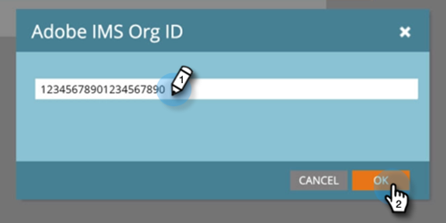

# Einrichten der Adobe-Organisationszuordnung {#set-up-adobe-organization-mapping}

Um mit Adobe-Programmen wie Audience Manager, dem B2B CDP-Marketo-Connector, [!DNL Dynamic Chat] usw. zu synchronisieren, müssen Sie zunächst Ihre Anmeldedaten für die Adobe IMS-Organisation in Marketo Engage eingeben.

>[!NOTE]
>
>* Eine HIPAA-fähige Bereitstellung einer Marketo-Instanz kann diese Integration nicht verwenden.
>* Damit die Integration funktioniert, müssen Marketo und Ihre anderen Adobe-Programme sich in derselben Organisation befinden.

>[!IMPORTANT]
>
>Für diejenigen, die sich in der Adobe Business Platform und im Identity Management-System befinden, ist die mit dem Abonnement verknüpfte Organisations-ID bereits ausgefüllt und schreibgeschützt. Die in diesem Artikel beschriebenen Schritte wären daher nicht anwendbar.

1. Klicken Sie in Marketo auf **[!UICONTROL Admin]**.

   

1. Klicken Sie unter Integration auf **[!UICONTROL Adobe-Organisationszuordnung]**.

   

1. Klicken Sie auf **[!UICONTROL Bearbeiten]**.

   

1. Geben Sie Ihre Adobe IMS-Organisations-ID ein (erfahren Sie hier[ wie Sie sie finden](https://experienceleague.adobe.com/docs/control-panel/using/faq.html?lang=de){target="_blank"} und klicken Sie auf **[!UICONTROL OK]**.

   

1. Klicken Sie auf **[!UICONTROL Bestätigen]**.

   

1. Klicken Sie auf **[!UICONTROL Schließen]**.

   

   >[!IMPORTANT]
   >
   >Aus Sicherheitsgründen müssen Sie ein Organisations-Admin für die Adobe-Organisation sein, der Sie zuordnen möchten. Ist dies nicht der Fall, schlägt die Aktion fehl. Darüber hinaus müssen Adobe-Benutzende und Marketo-Benutzende beim Anmelden dieselbe E-Mail-Adresse verwenden.

1. Wenn Sie _noch nicht_ angemeldet sind, wird ein Popup-Fenster in einer neuen Registerkarte/einem neuen Fenster angezeigt. Melden Sie sich bei Ihrer Adobe-Organisation an (dieser Vorgang validiert den Organisationszugriff).

Sie können [ Adobe Experience Cloud jetzt Zielgruppendaten ](/help/marketo/product-docs/core-marketo-concepts/smart-lists-and-static-lists/static-lists/send-a-list-to-adobe-experience-cloud.md){target="_blank"} oder [synchronisieren](/help/marketo/product-docs/adobe-experience-cloud-integrations/sync-an-audience-from-adobe-experience-cloud.md){target="_blank"}.
