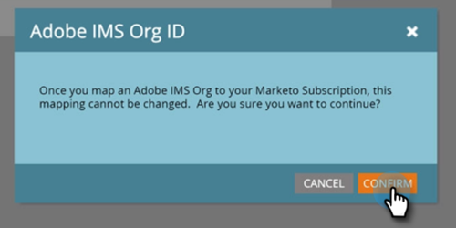

# Einrichten der Adobe-Organisationszuordnung {#set-up-adobe-organization-mapping}

Um eine Synchronisierung mit Adobe Apps wie Audience Manager, dem Marketo-Connector der B2B-CDP-Datei, Dynamic Chat usw. herzustellen, müssen Sie zunächst Ihre Adobe IMS-Org-Anmeldedaten in Marketo eingeben.

>[!NOTE]
>
>Eine HIPAA-bereite Bereitstellung einer Marketo-Instanz kann diese Integration nicht verwenden.

>[!CAUTION]
>
>Für Kunden, die in die Adobe Business Platform und Identity Management integriert sind, wird die mit dem Abonnement verknüpfte Organisations-ID bereits ausgefüllt und ist ein schreibgeschütztes Feld.

1. Klicken Sie in Marketo auf **Admin**.

   

1. Klicken Sie unter &quot;Integration&quot;auf **Adobe-Organisationszuordnung**.

   

1. Klicken **Bearbeiten**.

   

1. Geben Sie Ihre Adobe IMS-Organisations-ID ein (erfahren Sie, wie Sie [here](https://experienceleague.adobe.com/docs/control-panel/using/faq.html)) und klicken Sie auf **OK**.

   

1. Klicken **Bestätigen**.

   

1. Klicken **Schließen**.

   

   >[!IMPORTANT]
   >
   >Aus Sicherheitsgründen müssen Sie Org-Admin für die Adobe-Organisation sein, der Sie eine Zuordnung zuweisen möchten. Wenn du nicht bist, schlägt die Aktion fehl. Außerdem müssen der Adobe-Benutzer und der Marketo-Benutzer bei der Anmeldung dieselbe E-Mail-Adresse verwenden.

1. Wenn du _not_ bereits angemeldet ist, wird ein Popup in einer neuen Registerkarte/einem neuen Fenster angezeigt. Melden Sie sich bei Ihrer Adobe-Organisation an (durch diese Aktion wird der Organisationszugriff überprüft).

Und das ist es! Sie können jetzt [Zielgruppendaten freigeben](/help/marketo/product-docs/core-marketo-concepts/smart-lists-and-static-lists/static-lists/send-a-list-to-adobe-experience-cloud.md){target=&quot;_blank&quot;} zu oder [Zielgruppe synchronisieren](/help/marketo/product-docs/adobe-experience-cloud-integrations/sync-an-audience-from-adobe-experience-cloud.md){target=&quot;_blank&quot;} aus Adobe Experience Cloud.
