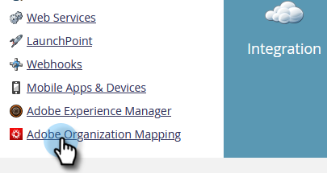

# Einrichten der Adobe-Organisationszuordnung {#set-up-adobe-organization-mapping}

Um eine Synchronisierung mit Adobe-Anwendungen wie Audience Manager herzustellen, muss der B2B CDP Marketo-Connector [!DNL Dynamic Chat]usw. müssen Sie zunächst Ihre Adobe IMS-Org-Anmeldedaten in Marketo Engage eingeben.

>[!NOTE]
>
>* Eine HIPAA-bereite Bereitstellung einer Marketo-Instanz kann diese Integration nicht verwenden.
>* Damit die Integration funktioniert, müssen sich Marketo und Ihre anderen Adobe-Anwendungen in derselben Organisation befinden.

>[!IMPORTANT]
>
>Für diejenigen, die an die Adobe Business Platform und das Identity Management-System angeschlossen sind, wird die mit dem Abonnement verknüpfte Organisations-ID bereits ausgefüllt und ist ein schreibgeschütztes Feld. Die Schritte in diesem Artikel würden daher nicht gelten.

1. Klicken Sie in Marketo auf **[!UICONTROL Admin]**.

   

1. Klicken Sie unter &quot;Integration&quot;auf **[!UICONTROL Adobe-Organisationszuordnung]**.

   

1. Klicks **[!UICONTROL Bearbeiten]**.

   

1. Geben Sie Ihre Adobe IMS-Organisations-ID ein (erfahren Sie, wie Sie [here](https://experienceleague.adobe.com/docs/control-panel/using/faq.html){target="_blank"}) und klicken Sie auf **[!UICONTROL OK]**.

   

1. Klicks **[!UICONTROL Bestätigen]**.

   

1. Klicken Sie auf **[!UICONTROL Schließen]**.

   

   >[!IMPORTANT]
   >
   >Aus Sicherheitsgründen müssen Sie Org-Admin für die Adobe-Organisation sein, der Sie eine Zuordnung zuweisen möchten. Wenn du nicht bist, schlägt die Aktion fehl. Außerdem müssen der Adobe-Benutzer und der Marketo-Benutzer bei der Anmeldung dieselbe E-Mail-Adresse verwenden.

1. Wenn du _not_ bereits angemeldet ist, wird ein Popup in einer neuen Registerkarte/einem neuen Fenster angezeigt. Melden Sie sich bei Ihrer Adobe-Organisation an (diese Aktion validiert den Organisationszugriff).

Und das ist es! Sie können jetzt [Zielgruppendaten freigeben](/help/marketo/product-docs/core-marketo-concepts/smart-lists-and-static-lists/static-lists/send-a-list-to-adobe-experience-cloud.md){target="_blank"} to, or [sync an audience](/help/marketo/product-docs/adobe-experience-cloud-integrations/sync-an-audience-from-adobe-experience-cloud.md){target="_blank"} aus Adobe Experience Cloud.
