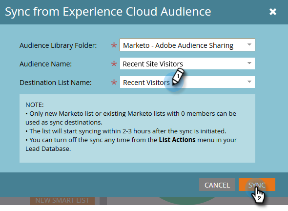

# Synchronisieren einer Zielgruppe aus Adobe Experience Cloud {#sync-an-audience-from-adobe-experience-cloud}

>[!NOTE]
>
>Eine HIPAA-fähige Bereitstellung einer Marketo-Instanz kann diese Integration nicht verwenden.

>[!PREREQUISITES]
>
>[Einrichten der Adobe-Organisationszuordnung](/help/marketo/product-docs/adobe-experience-cloud-integrations/set-up-adobe-organization-mapping.md){target="_blank"}

## So synchronisieren Sie eine Zielgruppe {#how-to-sync-an-audience}

1. Klicken Sie in My Marketo auf die Kachel **[!UICONTROL Datenbank]**.

   

1. Klicken Sie auf **[!UICONTROL Neu]** und wählen Sie **[!UICONTROL Aus Experience Cloud-Zielgruppe synchronisieren]**.

   

1. Klicken Sie auf **[!UICONTROL Zielgruppenbibliotheksordner]** und wählen Sie den gewünschten Ursprungsordner aus.

   

1. Wählen Sie einen **[!UICONTROL Zielgruppennamen]** aus.

   

1. Für das Ziel können Sie eine vorhandene Liste auswählen oder den Namen einer neuen Liste eingeben. In diesem Beispiel erstellen wir ein neues. Klicken Sie **[!UICONTROL auf]** Synchronisieren“.

   

1. Klicken Sie auf **[!UICONTROL OK]**.

   

## FAQs {#faq}

**Wie funktioniert die Cookie-Synchronisierung?**

Wenn die Cookie-Synchronisierung für Ihr Marketo-Abonnement aktiviert ist, versucht munchkin.js von Marketo, Adobe-ECIDs für die Adobe IMS-Organisation zu erfassen und zu speichern, die Sie während der Integrationseinrichtung angegeben haben, und diese ECIDs mit der entsprechenden Marketo-Cookie-Kennung abzugleichen. Dadurch können anonyme Benutzerprofile von Marketo mit Adobe-ECIDs angereichert werden.

Ein weiterer Schritt ist erforderlich, um das anonyme Benutzerprofil mit einem Lead-Profil zu verknüpfen, das mithilfe einer Nur-Text-E-Mail identifiziert wird. Wie das genau funktioniert [wird hier beschrieben](/help/marketo/product-docs/reporting/basic-reporting/report-activity/tracking-anonymous-activity-and-people.md){target="_blank"}.

**Warum unterscheidet sich die Listengröße in Marketo von der in Adobe?**

Eine Person wird auch nicht synchronisiert, wenn wir eine ECID-Cookie-ID nicht an eine bekannte Person in Marketo binden können.

**Handelt es sich um eine einmalige Synchronisation?**

Sie müssen die Synchronisierung nur einmal starten. Danach werden die Datensätze automatisch synchronisiert. Die Erstsynchronisierung kann bis zu 24 Stunden dauern. In Zukunft werden neue Datensätze in 2-3 Stunden synchronisiert.
