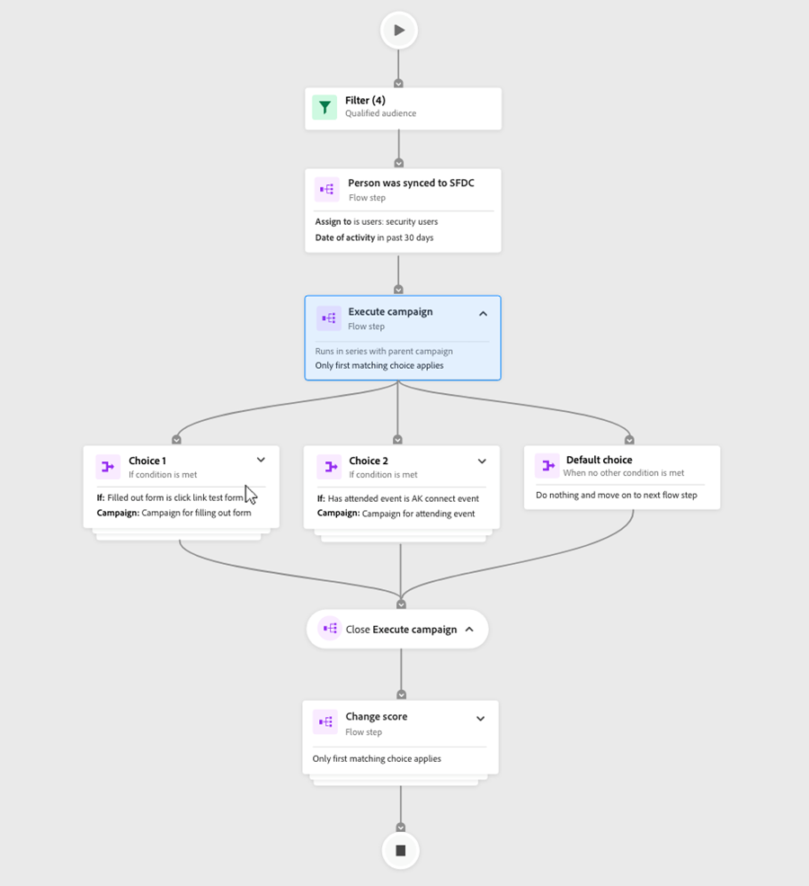
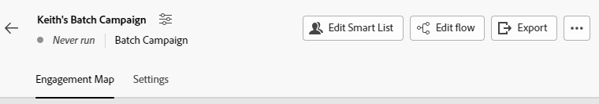

# Interaktionsübersicht {#engagement-map-overview}

>[!AVAILABILITY]
>
>Diese Funktion ist derzeit für Smart-Kampagnen verfügbar. Sie steht nicht für Programme zur Verfügung.

Mit der Interaktionskarte können Sie mithilfe intuitiver Visualisierungen wiederverwendbare Smart-Kampagnen erstellen. Es bietet vollständige Abwärtskompatibilität mit allen bestehenden Marketo Engage-Smart-Kampagnen, ohne dass aktuelle Funktionen verloren gehen.

## Zugriff auf Interaktionszuordnung {#accessing-engagement-map}

Navigieren Sie zu einer vorhandenen Kampagne und klicken Sie auf die Schaltfläche **Interaktionskarte** Schaltfläche.

In der Interaktionszuordnung werden Ihnen zwei Registerkarten angezeigt: [Interaktionskarte](/help/marketo/product-docs/core-marketo-concepts/engagement-map/engagement-map-tab.md){target="_blank"} and [Settings](/help/marketo/product-docs/core-marketo-concepts/engagement-map/settings-tab.md){target="_blank"}.

## Kartenbeschreibungen {#card-descriptions}

**Trigger**: In Kampagnen, die Trigger enthalten, wird die Karte über die Karte &quot;Trigger-Übersicht&quot;verfügen. Wenn Sie darauf klicken, werden eine Karte für jeden Trigger sowie ein Slide-out-Bedienfeld mit zusätzlichen Informationen angezeigt.

**Filter**: In Kampagnen, die Filter enthalten, enthält die Zuordnung für jede Karte eine Karte. Wenn Sie darauf klicken, wird ein Slide-out-Bedienfeld mit zusätzlichen Informationen angezeigt.

**Flussschritte**: Jede Kampagne enthält eine Karte für jeden Flussschritt. Wenn Sie darauf klicken, wird ein Slide-out-Bedienfeld mit zusätzlichen Informationen angezeigt.

**Auswahlmöglichkeiten**: Wenn ein Flussschritt eine oder mehrere Optionen enthält, werden beim Klicken auf die Flusskarte eine Karte für jede Auswahl sowie ein Dias-out-Bedienfeld mit zusätzlichen Informationen angezeigt.

## Verschachtelte Kampagnen {#nested-campaigns}

* Wenn eine Kampagne einen Schritt zum Anfordern oder Ausführen des Kampagnenflusses enthält, werden beim Klicken auf die Flusskarte Details zur aufgerufenen Kampagne sowie ein Slide-out-Bedienfeld mit zusätzlichen Informationen angezeigt.

* Wenn eine Kampagne einen Schritt zum Anfordern oder Ausführen eines Kampagnenflusses mit Optionen enthält, werden beim Klicken auf die Flusskarte eine Auswahlkarte sowie ein Slide-out-Fenster mit weiteren Informationen zu den Optionen angezeigt. Wenn Sie auf jede Auswahlkarte klicken, werden Details zur aufgerufenen Kampagne sowie ein Slide-out-Bedienfeld mit weiteren Informationen angezeigt.

* Wenn außerdem eine der verschachtelten Kampagnen einen Schritt zum Anfordern oder Ausführen des Kampagnenflusses aufweist, werden beim Klicken auf die Flusskarte Details zur Kampagne angezeigt. Dasselbe gilt, wenn der Flussschritt Optionen enthält.

## Obere Navigation {#top-navigation}

Die obere Navigationsleiste enthält die folgenden Funktionen:

* Kampagnenname und Zugriff auf das Modal &quot;Kampagne bearbeiten&quot;, können Sie hier den Namen und die Beschreibung der Kampagne bearbeiten.

* Kampagnenstatus und -typ werden unter dem Kampagnennamen angezeigt

* Schaltfläche &quot;Aktivieren/Deaktivieren&quot;für Trigger-Kampagnen

* Smart-Liste bearbeiten - Sie werden in einer neuen Registerkarte zur Benutzeroberfläche der Smart-Liste navigieren, auf der Sie Ihre Smart-Liste hinzufügen oder bearbeiten können

* Fluss bearbeiten: Sie werden auf einer neuen Registerkarte zur Fluss-Benutzeroberfläche navigiert, auf der Sie Ihre Smart-Liste hinzufügen oder bearbeiten können.

* Export - Hiermit wird ein Bild der Kampagnenvisualisierung heruntergeladen. Die heruntergeladene Version spiegelt alle Verzweigungen wider, die Sie erweitert haben

* Anzeigen von Kampagnenmitgliedern : Dadurch wird eine neue Registerkarte mit Details zu Kampagnenmitgliedern geöffnet.

>[!NOTE]
>
>Änderungen, die in einer geöffneten Registerkarte Smart List und Fluss vorgenommen wurden, werden bei der Aktualisierung auf der Registerkarte Interaktionszuordnung angezeigt. Es wird nicht automatisch aktualisiert. Automatisch gespeicherte Aktualisierungen und Änderungen werden angezeigt.

## FAQs {#faq}

**Muss ich alle meine Kampagnen in der Interaktionszuordnung neu erstellen?**

Anz. Interaktionszuordnung ist vollständig abwärtskompatibel. Mit einem Klick auf eine Schaltfläche können Sie jede Ihrer vorhandenen Kampagnen auf der visuellen Interaktionszuordnungsoberfläche anzeigen.

**Bedeutet die Verwendung von Interaktionskarten in Marketo Engage, dass ich den Zugriff auf die Ordnerstruktur verlieren werde und neu lernen muss, wie eine Smart-Kampagne erstellt wird?**

Anz. Das Tolle an Interaktionskarten ist, dass sie Ihnen das Beste aus beiden Welten bieten. Sie ergänzen die aktuelle Art und Weise, wie Sie Kampagnen erstellen. Sie können auswählen, ob Sie die vorhandene Benutzeroberfläche verwenden oder die neue Benutzeroberfläche erstellen/visualisieren möchten. Alle Benutzer erhalten weiterhin die leistungsstarken Funktionen von Marketo Engage, die jetzt durch ein visuelles Erstellungswerkzeug ergänzt werden.

**Ist Interaktionszuordnung ein kostenpflichtiges Add-on?**

Anz. Alle bestehenden und neuen Marketo Engage-Benutzer, die über alle Abonnements verfügen, haben Zugriff auf diese ergänzende Funktion.

**Bin ich als Marketo Engage-Administrator dafür verantwortlich, die Interaktionszuordnung ein-/auszuschalten?**

Anz. Interaktionszuordnung steht allen Benutzern in ihren Instanzen zur Verfügung. Für bestimmte Benutzer, Arbeitsbereiche usw. können Sie sie nicht aktivieren/deaktivieren.

**Ist derzeit alles in Smart-Kampagnen auch in der Interaktionszuordnung verfügbar?**

Ja. Die Interaktionszuordnung weist die volle Funktionsparität mit Smart-Kampagnen auf.

**Inwiefern unterscheidet sich dies von anderen visuellen Buildern?**

Es gibt drei wichtige Dinge, die Interaktionskarten auseinander setzen:

* Flexibilität: Einfache Verwaltung und Validierung von miteinander verbundenen oder tief verschachtelten Kampagnen mit Visualisierung.

* Funktionalität: Alle Visualisierungen sind vorkonfiguriert, was die Bedienung erleichtert. Die verschachtelte Struktur ermöglicht es Ihnen, einzutauchen und das ganze Bild zu erhalten.

* Leistung: Sie behalten die gesamte bestehende Komplexität des Marketo Engages bei, jetzt in einem visuellen Format.

>[!MORELIKETHIS]
>
>* [Registerkarte &quot;Interaktionskarte&quot;](/help/marketo/product-docs/core-marketo-concepts/engagement-map/engagement-map-tab.md){target="_blank"}
>* [Registerkarte &quot;Einstellungen&quot;](/help/marketo/product-docs/core-marketo-concepts/engagement-map/settings-tab.md){target="_blank"}
