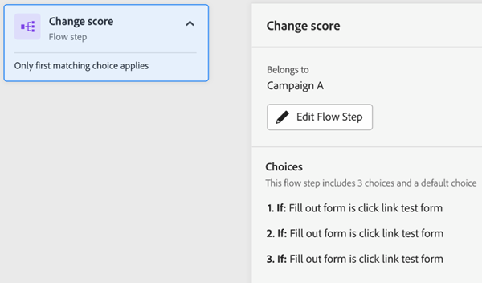
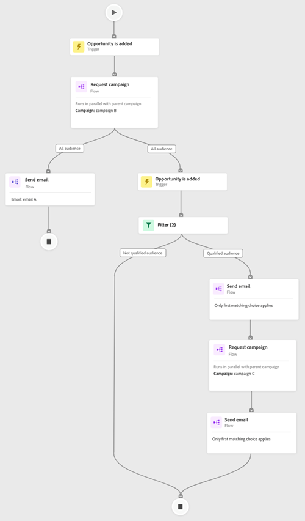
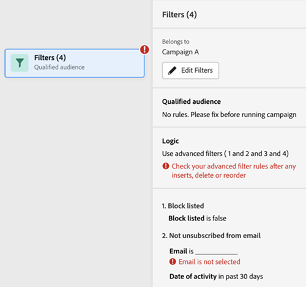

# Registerkarte &quot;Interaktionskarte&quot; {#engagement-map-tab}

Interaktionszuordnung wird durch eine Reihe von Trigger-, Filter- und Flusskarten dargestellt. Wenn Sie auf jede Karte klicken, werden zusätzliche Informationen angezeigt.

Übersicht über Trigger: Auf dieser Karte wird die Anzahl der Trigger in Ihrer Kampagne angezeigt. Wenn Sie darauf klicken, werden eine Karte für jeden Trigger sowie ein Slide-out-Bedienfeld mit den folgenden Informationen angezeigt:

* Kampagne, zu der der Trigger gehört
* Liste der Trigger-Namen
* Trigger bearbeiten

  

Trigger Detail: Auf dieser Karte wird der Name des Triggers angezeigt. Wenn Sie darauf klicken, wird ein Slide-out-Bedienfeld mit den folgenden Informationen angezeigt:

* Kampagne, zu der der Trigger gehört
* Liste der dem Trigger zugeordneten Begrenzungen
* Trigger bearbeiten

Filter: Wenn Sie auf diese Karte klicken, wird ein Slide-out-Bedienfeld mit den folgenden Informationen angezeigt:

* Kampagne, zu der der Filter gehört
* Geschätzte Anzahl von Personen, die sich für den Filter qualifizieren
* Liste der Filter und der jeweiligen Einschränkungen
* Filter bearbeiten

  

Flussschritte: Wenn ein Flussschritt Optionen enthält, wird auf dieser Karte der Name des Flussschritts angezeigt. Wenn Sie darauf klicken, wird ein Slide-out-Bedienfeld mit den folgenden Informationen angezeigt:

* Kampagne, zu der der Flussschritt gehört
* Liste der Auswahlbedingungen für den Flussschritt
* Flussschritt bearbeiten

Flussschritte: Wenn ein Flussschritt _not_ eine beliebige Auswahl enthalten, zeigt diese Karte die mit dem Flussschritt verknüpften Attribute an. Wenn Sie darauf klicken, wird ein Slide-out-Bedienfeld mit den folgenden Informationen angezeigt:

* Kampagne, zu der der Flussschritt gehört
* Liste der dem Flussschritt zugeordneten Attribute
* Flussschritt bearbeiten

  

## Flussschritt für Ausführen und Anfordern von Kampagnen {#flow-step-for-execute-and-request-campaigns}

* Wenn der Schritt Kampagnenfluss ausführen oder anfordern keine Optionen enthält, zeigt die Karte den Namen der Kampagne an. Wenn Sie auf die Karte klicken, wird ein Bedienfeld mit der folgenden Information angezeigt:

   * Kampagne, zu der der Flussschritt gehört
   * Flussschritt bearbeiten
   * Liste der dem Flussschritt zugeordneten Attribute
   * Schaltfläche &quot;Liste anzeigen&quot;, über die eine Liste von Kampagnen geöffnet wird, die die jeweilige Kampagne &quot;Anfrage/Ausführung&quot; verwenden

>[!NOTE]
>
>Sie können die Flussschritt(e) von einer primären Kampagne aus bearbeiten. Um verschachtelte Kampagnen zu bearbeiten, müssen Sie über den Link im Dia-out-Bedienfeld zur Kampagne navigieren.

* Wenn der Schritt &quot;Kampagnenfluss ausführen&quot;oder &quot;Kampagnenfluss anfordern&quot;Optionen enthält, wird beim Klicken auf die Karte ein Fenster mit einer Folie mit den folgenden Informationen angezeigt:

   * Kampagne, zu der der Flussschritt gehört
   * Liste der Auswahlbedingungen für den Flussschritt
   * Flussschritt bearbeiten

* Wenn eine Ausführen- oder Anforderungskampagne Optionen enthält, wird das Klicken auf die Flusskarte erweitert, um alle Optionen in einzelnen Karten anzuzeigen. Klicken Sie auf die _choice_ -Karte die mit der jeweiligen Auswahl verknüpfte Kampagne erweitern und ein Slide-out-Bedienfeld mit den folgenden Informationen anzeigen:

   * Kampagne, zu der die Auswahl gehört
   * Auswahl bearbeiten
   * Liste der Auswahlbedingungen für den Flussschritt
   * Liste anzeigen, wodurch eine Liste der Kampagnen geöffnet wird, die die jeweilige Kampagne &quot;Anfrage/Ausführen&quot;verwenden

  

## Visualisieren einer verschachtelten Execute-Kampagne {#visualizing-a-nested-execute-campaign}

Führen Sie Kampagnen mit der übergeordneten Kampagne nacheinander aus. Personen, die sich für eine ausführbare Kampagne qualifizieren, führen alle Flussschritte aus der Kampagne aus und kehren zur primären Kampagne zurück, um die Flussschritte dieser Kampagne zu durchlaufen.

Im Folgenden finden Sie ein Beispiel einer Smart-Kampagne, &quot;Kampagne A&quot;, die einen Ausführungs-Kampagnenflussschritt enthält. Stellen Sie sich &quot;Kampagne A&quot;als Ihre primäre Kampagne vor.

1. Wenn Sie auf die Karte Kampagnenfluss ausführen klicken, werden Details zu &quot;Kampagne B&quot;angezeigt.
1. &quot;Kampagne B&quot;enthält einen Filter, der die Zielgruppe in zwei Gruppen unterteilt: qualifiziert und nicht qualifiziert.
1. Qualifizierte Zielgruppen durchlaufen die mit &quot;Kampagne B&quot;verknüpften Flussschritte.
1. Alle (qualifizierten und nicht qualifizierten) Zielgruppen kehren zu &quot;Kampagne A&quot;zurück und fahren mit dem nächsten Flussschritt fort.

   

Sie können in &quot;Kampagne B&quot;auf den Schritt Kampagnenfluss ausführen klicken. Daraufhin werden die Auswahlkarten und die mit jeder Auswahl verknüpfte Kampagne angezeigt.

## Visualisieren von Anforderungskampagnen {#visualizing-request-campaign}

Anfragekampagnen werden parallel zur übergeordneten Kampagne ausgeführt. Personen, die sich für eine Anfragekampagne qualifizieren, führen alle Flussschritte der Kampagne aus und beenden dann die Kampagne. Gleichzeitig durchlaufen dieselben Personen die Flussschritte der primären Kampagne.

Im Folgenden finden Sie ein Beispiel für eine Smart-Kampagne, &quot;Kampagne A&quot;, die einen Schritt zum Anforderungskampagnenfluss enthält. Stellen Sie sich &quot;Kampagne A&quot;als Ihre primäre Kampagne vor.

1. Wenn Sie auf die Flusskarte der Anfragekampagne klicken, werden die Details von &quot;Kampagne B&quot;angezeigt.
1. &quot;Kampagne B&quot;enthält einen Filter, der die Zielgruppe in zwei Gruppen unterteilt: qualifiziert und nicht qualifiziert.
1. Qualifizierte Zielgruppen durchlaufen die mit &quot;Kampagne B&quot;verknüpften Flussschritte.
1. Gleichzeitig wechseln alle Zielgruppen zu den nächsten Flussschritten in &quot;Kampagne A&quot;.

   

Sie können Ihre verschachtelten Kampagnen genauer untersuchen, wenn eines der Flussschritte eine andere Anfragekampagne enthält, indem Sie auf die Flusskarte klicken, um die Details der Kampagne anzuzeigen.

Im Folgenden finden Sie ein Beispiel für eine Anforderungskampagne mit Auswahlmöglichkeiten.

## Umgang mit Fehlern {#error-handling}

Fehler in Smart-Listen und Fluss-Schritten werden über ein Fehlersymbol auf der Karte hervorgehoben. Darüber hinaus wird eine entsprechende Fehlermeldung im Dia-out-Bedienfeld angezeigt.

Unten finden Sie ein Beispiel für einen Fehler in einem Trigger, der auf der Übersichtskarte &quot;Trigger&quot;, im Slide-out-Bedienfeld und auf der Detailkarte des Triggers angezeigt wird.

**Fehler in Filterkarten können Folgendes enthalten:**

* Fehler in der Smart-Liste, der dazu führt, dass die qualifizierte Zielgruppe nicht angezeigt wird

* Fehler in der Filterlogik

* Fehler bei Begrenzungen (oder fehlende Beschränkungen) in einem oder mehreren Filtern

  

>[!NOTE]
>
>Fehler innerhalb einer verschachtelten Kampagne werden erst sichtbar, wenn Sie zum Erweitern der verschachtelten Kampagne auf klicken.
