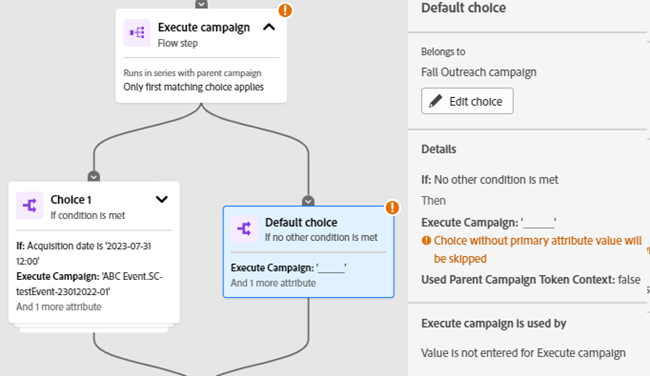

# Registerkarte Interaktionszuordnung {#engagement-map-tab}

Interaktionszuordnung wird durch eine Reihe von Trigger-, Filter- und Flusskarten dargestellt. Wenn Sie auf jede Karte klicken, werden zusätzliche Informationen angezeigt.

Kampagnenübersicht: Auf dieser Karte wird die Anzahl der Trigger in der Trigger angezeigt. Wenn Sie darauf klicken, wird für jeden Trigger eine Karte sowie ein ausklappbares Bedienfeld mit den folgenden Informationen angezeigt:

* Kampagne, zu der der Trigger gehört
* Liste der Trigger-Namen
* Trigger bearbeiten

  

Trigger-Detail: Auf dieser Karte wird der Name des Triggers angezeigt. Wenn Sie darauf klicken, wird ein ausklappbares Bedienfeld mit den folgenden Informationen angezeigt:

* Kampagne, zu der der Trigger gehört
* Liste der Einschränkungen, die mit dem Trigger verbunden sind
* Trigger bearbeiten

Filter: Wenn Sie auf diese Karte klicken, wird ein ausklappbares Bedienfeld mit folgenden Informationen angezeigt:

* Der Kampagnenfilter gehört zu
* Geschätzte Anzahl der Personen, die sich für den Filter qualifizieren
* Liste der Filter und ihrer jeweiligen Einschränkungen
* Filter bearbeiten

  

Flussschritte: Wenn ein Flussschritt Auswahlmöglichkeiten enthält, zeigt diese Karte den Namen des Flussschritts an. Wenn Sie darauf klicken, wird ein ausklappbares Bedienfeld mit den folgenden Informationen angezeigt:

* Der Kampagnen-Flussschritt gehört zu
* Liste der Auswahlbedingungen, die mit dem Flussschritt verknüpft sind
* Flussschritt bearbeiten

Flussschritte: Wenn ein Flussschritt _keine Optionen enthält_ zeigt diese Karte die Attribute an, die mit dem Flussschritt verknüpft sind. Wenn Sie darauf klicken, wird ein ausklappbares Bedienfeld mit den folgenden Informationen angezeigt:

* Der Kampagnen-Flussschritt gehört zu
* Liste der mit dem Flussschritt verknüpften Attribute
* Flussschritt bearbeiten

  

## Flussschritt für Kampagnen des Typs „Ausführen“ und „Anfrage“ {#flow-step-for-execute-and-request-campaigns}

* Wenn der Kampagnenflussschritt Ausführen oder Anfrage keine Auswahlmöglichkeiten enthält, zeigt die Karte den Namen der Kampagne an. Durch Klicken auf die Karte wird ein ausklappbares Bedienfeld mit folgenden Informationen angezeigt:

   * Der Kampagnen-Flussschritt gehört zu
   * Flussschritt bearbeiten
   * Liste der mit dem Flussschritt verknüpften Attribute
   * Schaltfläche „Liste anzeigen“, mit der Sie eine Liste von Kampagnen öffnen, die die spezifische Kampagne „Anfrage/Ausführung“ verwenden

>[!NOTE]
>
>Sie können die Flussschritte in einer primären Kampagne bearbeiten. Um verschachtelte Kampagnen zu bearbeiten, müssen Sie über den Link im ausklappbaren Bedienfeld zur Kampagne navigieren.

* Wenn der Schritt Kampagnenfluss ausführen oder anfordern eine Auswahl enthält, wird beim Klicken auf die Karte ein ausklappbares Bedienfeld mit den folgenden Informationen angezeigt:

   * Der Kampagnen-Flussschritt gehört zu
   * Liste der Auswahlbedingungen, die mit dem Flussschritt verknüpft sind
   * Flussschritt bearbeiten

* Wenn eine Ausführungs- oder Kampagnenanfrage Optionen enthält, werden durch Klicken auf die Flusskarte alle Optionen in den einzelnen Karten angezeigt. Durch Klicken auf _Karte_ Auswahl“ wird die Kampagne, die mit der spezifischen Auswahl verbunden ist, erweitert und ein ausklappbares Bedienfeld mit den folgenden Informationen angezeigt:

   * Kampagne, zu der die Auswahl gehört
   * Auswahl bearbeiten
   * Liste der Auswahlbedingungen, die mit dem Flussschritt verknüpft sind
   * Liste anzeigen, mit der eine Liste der Kampagnen geöffnet wird, die die spezifische Kampagne „Anfrage/Ausführen“ verwenden

  

## Visualisieren einer verschachtelten Ausführungskampagne {#visualizing-a-nested-execute-campaign}

Kampagnen ausführen, die in Reihe mit der übergeordneten Kampagne ausgeführt werden. Personen, die sich für eine ausführbare Kampagne qualifizieren, führen alle Flussschritte der Kampagne aus und kehren zur primären Kampagne zurück, um die Flussschritte dieser Kampagne zu durchlaufen.

Nachfolgend finden Sie ein Beispiel für eine intelligente Kampagne, „Kampagne A“, die einen Schritt zum Ausführen eines Kampagnenflusses enthält. Stellen Sie sich „Kampagne A“ als primäre Kampagne vor.

1. Durch Klicken auf die Karte Kampagnenfluss ausführen werden Details zu „Kampagne B“ erweitert.
1. „Kampagne B“ enthält einen Filter, der die Zielgruppe in zwei Gruppen aufteilt: „Qualifiziert“ und „Nicht qualifiziert“.
1. Eine qualifizierte Zielgruppe durchläuft die mit „Kampagne B“ verknüpften Flussschritte.
1. Alle Audiences (qualifiziert und nicht qualifiziert) kehren zu „Kampagne A“ zurück und fahren mit dem nächsten Flussschritt fort.

   

Sie können auf den Schritt Kampagnenfluss ausführen in „Kampagne B“ klicken, der erweitert wird, um die Auswahlkarten und die Kampagne anzuzeigen, die mit jeder Auswahl verbunden sind.

## Visualisieren der Anfragekampagne {#visualizing-request-campaign}

Anforderungskampagnen werden parallel zur übergeordneten Kampagne ausgeführt. Personen, die sich für eine Anfragekampagne qualifizieren, führen alle Flussschritte der Kampagne aus und beenden dann die Kampagne. Gleichzeitig durchlaufen dieselben Personen die Fluss -Schritte der primären Kampagne.

Im Folgenden finden Sie ein Beispiel für eine intelligente Kampagne, „Kampagne A“, die den Schritt Kampagnenanfrage - Fluss enthält. Stellen Sie sich „Kampagne A“ als primäre Kampagne vor.

1. Durch Klicken auf die Karte Kampagnenfluss anfragen werden die Details von „Kampagne B“ eingeblendet
1. „Kampagne B“ enthält einen Filter, der die Zielgruppe in zwei Gruppen aufteilt: „Qualifiziert“ und „Nicht qualifiziert“.
1. Eine qualifizierte Zielgruppe durchläuft die mit „Kampagne B“ verknüpften Flussschritte.
1. Gleichzeitig wechselt alle Zielgruppen zu den nächsten Fluss -Schritten in „Kampagne A“.

   

Sie können Ihre verschachtelten Kampagnen genauer betrachten, wenn einer der Flussschritte eine andere Anfragekampagne enthält, indem Sie auf die Flusskarte klicken, um die Details der Kampagne anzuzeigen.

Im Folgenden finden Sie ein Beispiel für eine Anfragekampagne mit Auswahlmöglichkeiten.

## Umgang mit Fehlern {#error-handling}

Fehler in Smart-Listen und Flussschritten werden durch ein rotes Symbol auf der Karte hervorgehoben. Zusätzlich wird eine entsprechende Fehlermeldung im ausklappbaren Bedienfeld angezeigt.

Warnungen in Smart Lists und Flussschritten werden durch ein orangefarbenes Symbol auf der Karte hervorgehoben. Zusätzlich wird eine entsprechende Warnmeldung im ausklappbaren Bedienfeld angezeigt.

Nachfolgend finden Sie ein Beispiel für eine Warnung in einer Auswahlkarte, die auf der Karte „Kampagnenfluss-Schritt ausführen“, im ausklappbaren Bedienfeld und auf der Karte „Standardauswahl“ angezeigt wird.

>[!NOTE]
>
>Warnungen sind Empfehlungen, die zu überprüfen sind, aber keine Hinweise auf Fehler in der intelligenten Kampagne sind.

**Fehler in Filterkarten können Folgendes umfassen:**

* Fehler in der Smart-Liste, der dazu führt, dass keine qualifizierte Zielgruppe angezeigt wird

* Fehler in der Filterlogik

* Fehler bei Einschränkungen (oder deren Fehlen) in einem oder mehreren Filtern

  

>[!NOTE]
>
>Fehler in einer verschachtelten Kampagne werden erst angezeigt, wenn Sie darauf geklickt haben, um die verschachtelte Kampagne zu erweitern.
