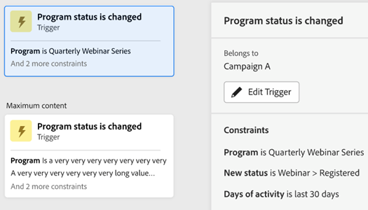

# Registerkarte &quot;Interaktionskarte&quot; {#engagement-map-tab}

Interaktionszuordnung wird durch eine Reihe von Trigger-, Filter- und Flusskarten dargestellt. Wenn Sie auf jede Karte klicken, werden zusätzliche Informationen angezeigt.

Übersicht über Trigger: Auf dieser Karte wird die Anzahl der Trigger in Ihrer Kampagne angezeigt. Wenn Sie darauf klicken, werden eine Karte für jeden Trigger sowie ein Slide-out-Bedienfeld mit den folgenden Informationen angezeigt:

* Kampagne, zu der der Trigger gehört
* Liste der Trigger-Namen
* Schaltfläche &quot;Trigger bearbeiten&quot;

  

Trigger-Detail: Auf dieser Karte wird der Name des Triggers angezeigt. Wenn Sie darauf klicken, wird ein Slide-out-Bedienfeld mit den folgenden Informationen angezeigt:

* Kampagne, zu der der Trigger gehört
* Liste der dem Trigger zugeordneten Begrenzungen
* Schaltfläche &quot;Trigger bearbeiten&quot;

  

Filter: Wenn Sie auf diese Karte klicken, wird ein Bedienfeld mit den folgenden Informationen angezeigt:

* Kampagne, zu der der Trigger gehört
* Geschätzte Anzahl von Personen, die sich für den Filter qualifizieren
* Liste der Filter und der jeweiligen Einschränkungen
* Schaltfläche &quot;Filter bearbeiten&quot;

  

Flussschritte: Wenn ein Flussschritt Optionen enthält, zeigt diese Karte den Namen des Flussschritts an. Wenn Sie darauf klicken, wird ein Slide-out-Bedienfeld mit den folgenden Informationen angezeigt:

* Campaign Der Fluss -Schritt gehört zu
* Liste der Auswahlbedingungen, die dem Flussschritt zugeordnet sind
* Schaltfläche &quot;Fluss bearbeiten&quot;

  

Flussschritte: Wenn ein Flussschritt _not_ alle Optionen einschließen, zeigt diese Karte Attribute an, die mit dem Flussschritt verknüpft sind. Wenn Sie darauf klicken, wird ein Slide-out-Bedienfeld mit den folgenden Informationen angezeigt:

* Campaign Der Fluss -Schritt gehört zu
* Liste der mit dem Flussschritt verknüpften Attribute
* Schaltfläche &quot;Fluss bearbeiten&quot;

  

## Flussschritt für Ausführen und Anfordern von Kampagnen {#flow-step-for-execute-and-request-campaigns}

* Wenn der Schritt Kampagnenfluss ausführen oder anfordern keine Optionen enthält, zeigt die Karte den Namen der Kampagne an. Wenn Sie auf die Karte klicken, wird ein Bedienfeld mit der folgenden Information angezeigt:

   * Kampagne, zu der der Flussschritt gehört
   * Schaltfläche &quot;Fluss bearbeiten&quot;
   * Liste der mit dem Flussschritt verknüpften Attribute
   * Schaltfläche &quot;Liste anzeigen&quot;, über die eine Liste von Kampagnen geöffnet wird, die die jeweilige Kampagne &quot;Anfrage/Ausführung&quot; verwenden

>[!NOTE]
>
>Sie können die Flussschritte von einer primären Kampagne aus bearbeiten. Um verschachtelte Kampagnen zu bearbeiten, müssen Sie über den Link im Dia-out-Bedienfeld zur Kampagne navigieren.

* Wenn der Schritt Kampagnenfluss ausführen oder anfordern eine Auswahl enthält, zeigt die Karte den Namen der Kampagne an. Wenn Sie auf die Karte klicken, wird ein Bedienfeld mit der folgenden Information angezeigt:

   * Kampagne, zu der der Flussschritt gehört
   * Liste der Auswahlbedingungen, die dem Flussschritt zugeordnet sind
   * Schaltfläche &quot;Fluss bearbeiten&quot;

  

  

* Wenn eine Ausführen- oder Anforderungskampagne Optionen enthält, wird das Klicken auf die Flusskarte erweitert, um alle Optionen in einzelnen Karten anzuzeigen. Wenn Sie auf die Auswahlkarte klicken, wird die mit der jeweiligen Auswahl verknüpfte Kampagne erweitert und ein Slide-out-Bedienfeld mit den folgenden Informationen angezeigt:

   * Kampagne, zu der die Auswahl gehört
   * Schaltfläche &quot;Auswahl bearbeiten&quot;
   * Liste der Auswahlbedingungen, die dem Flussschritt zugeordnet sind
   * Schaltfläche &quot;Liste anzeigen&quot;, über die eine Liste von Kampagnen geöffnet wird, die die jeweilige Kampagne &quot;Anfrage/Ausführung&quot; verwenden

  

## Visualisieren einer verschachtelten Execute-Kampagne {#visualizing-a-nested-execute-campaign}

BEARBEITUNG HIER ZURÜCK —

Führen Sie Kampagnen, die nacheinander ausgeführt werden, mit den übergeordneten Kampagnenträgern aus, die für eine ausführbare Kampagne infrage kommen, durch. Schließen Sie alle Flussschritte von der Kampagne ab und kehren Sie zur primären Kampagne zurück, um die Durchsatzschritte dieser Kampagne zu durchlaufen.

Nachstehend finden Sie ein Beispiel für eine intelligente Kampagne, &quot;Kampagne A&quot;, die einen Schritt zum Ausführen des Kampagnenflusses enthält. Stellen Sie sich &quot;Kampagne A&quot;als Ihre primäre Kampagne vor.

1. Wenn Sie auf die Karte Kampagnenfluss ausführen klicken, werden Details zu &quot;Kampagne B&quot;angezeigt.
1. &quot;Kampagne B&quot;enthält einen Filter, der zu einer qualifizierten und nicht qualifizierten Zielgruppe verzweigt.
1. Qualifizierte Zielgruppen durchlaufen die mit &quot;Kampagne B&quot;verknüpften Flussschritte.
1. Alle Zielgruppen (qualifiziert und nicht qualifiziert) kehren zu &quot;Kampagne A&quot;zurück und fahren mit dem nächsten Flussschritt fort.

BEARBEITUNG HIER ABGESCHLOSSEN —

Sie können in &quot;Kampagne B&quot;auf den Schritt Kampagnenfluss ausführen klicken. Daraufhin werden Auswahlkarten und die mit jeder Auswahl verknüpfte Kampagne angezeigt.

## Visualisieren von Anforderungskampagnen {#visualizing-request-campaign}

Anfragekampagnen werden parallel zur übergeordneten Kampagne ausgeführt, d. h. Leads, die für eine Anfragekampagne qualifiziert sind, führen alle Durchsatzschritte aus der Kampagne aus und beenden die Kampagne. Parallel dazu durchlaufen dieselben Leads auch die Flussschritte der primären Kampagne.

Im Folgenden finden Sie ein Beispiel einer intelligenten Kampagne &quot;Kampagne A&quot;, die einen Schritt zum Anforderungskampagnenfluss enthält. Sie können sich vorstellen, dass &quot;Kampagne A&quot;Ihre primäre Kampagne ist.

1. Wenn Sie auf die Karte für den Ablauf der Anforderungskampagne klicken, werden Details von &quot;Kampagne B&quot;angezeigt
1. Kampagne B enthält Filter, welche Verzweigungen in die qualifizierte Zielgruppe eingehen.
1. Qualifizierte Zielgruppe durchläuft die mit &quot;Kampagne B&quot;verknüpften Flussschritte.
1. Parallel dazu wechseln alle Zielgruppen zu den nächsten Flussschritten in &quot;Kampagne A&quot;.

   

Sie können tiefer in verschachtelte Kampagnen eintauchen, wenn einer der Flussschritte eine weitere Anfragekampagne enthält, indem Sie auf die Flusskarte klicken, um Details zur Kampagne anzuzeigen.

Hier ist ein Beispiel für eine Anforderungskampagne mit Auswahlmöglichkeiten.

## Umgang mit Fehlern {#error-handling}

Fehler in den Schritten &quot;Smart-Liste&quot;und &quot;Fluss&quot;werden über das Fehlersymbol auf der Karte hervorgehoben. Darüber hinaus wird die entsprechende Fehlermeldung im Bedienfeld &quot;Folie ausblenden&quot;angezeigt.

Im Folgenden finden Sie ein Beispiel für einen Fehler in Trigger, der auf der Übersichtskarte Trigger, im Bedienfeld &quot;Folie&quot;sowie auf der Trigger-Detailkarte angezeigt wird.

Fehler in Filterkarte kann enthalten

Fehler in der Smart-Liste, der dazu führt, dass keine qualifizierte Zielgruppe angezeigt wird

Fehler in Filterlogik

Fehler bei Beschränkungen oder Fehlen von Beschränkungen in einem oder mehreren Filtern

Wenn Sie keine Werte (Attribute) eingeben, werden sie nicht als Fehler gekennzeichnet. Sie funktionieren weiterhin wie auf der Registerkarte &quot;Fluss&quot;. Daher werden bestehende Kampagnen nicht gestört. Wenn jedoch Flussschritte keine Attribute enthalten, werden diese als Warnungen angezeigt.

Hinweis: Fehler innerhalb einer verschachtelten Kampagne sind erst sichtbar, wenn Sie zum Erweitern der verschachtelten Kampagne auf klicken
