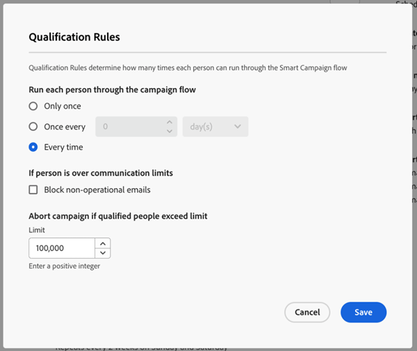
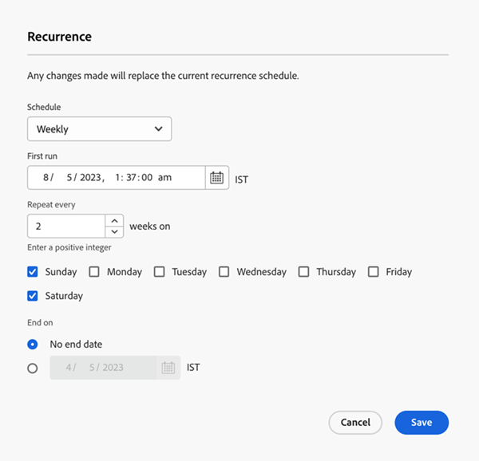

# Registerkarte &quot;Einstellungen&quot; {#settings-tab}

Auf der Registerkarte Einstellungen befinden sich alle Kampagneneinstellungen, einschließlich der gleichen Berechtigungssätze und des Zugriffs auf die Registerkarte Planung . DIE BESUCHUNG DIESES TABS WIRD NICHT UNTERBRECHEN? WENDEN SIE SICH AN ABLEGEN ODER WIEDERHOLEN - LOPA WIRD BESTÄTIGEN, DASS bestehende Kampagneneinstellungen nicht gestört werden.

Er enthält die folgenden drei Abschnitte.

* **Qualifikationsregeln**: Bestimmt, wie oft jede Person den Fluss der intelligenten Kampagne durchlaufen kann.

* **Einzelne Ausführungen**: Kann verwendet werden, um einzelne Ausführungen entweder sofort oder in Zukunft zu planen.

* **Wiederholung**: Wird zur Planung einer täglichen, wöchentlichen oder monatlichen Wiederholung verwendet.

  

Qualifikationsregeln sind für alle Kampagnen (Trigger und Batch) verfügbar und umfassen die folgenden Einstellungen:

* Sie können bestimmen, wie oft eine Person eine Kampagne durchläuft
* Die Möglichkeit, eine nicht operative Kampagne zu blockieren, wenn die Person ihr Kommunikationslimit überschritten hat
* Die Möglichkeit, eine Abbruchkampagne festzulegen, die von Personen begrenzt wird

  

Einzelne Ausführungen können verwendet werden, um entweder eine Kampagne sofort auszuführen oder in Zukunft einige einmalige Ausführungen einzurichten.

>[!TIP]
>
>Wenn Sie eine Reihe von Kampagnen planen, ist es einfacher, das Wiederholungsmodal zu verwenden.

Das Wiederholungsmodal bietet die Möglichkeit, einen wiederkehrenden Zeitplan täglich, wöchentlich oder monatlich einzurichten. Nach der Einrichtung können Sie die nächsten drei Ausführungen auf der Registerkarte Einstellungen sehen.

Die Registerkarte Einstellungen bietet außerdem einen schnellen Überblick über Ihre Smart-Liste. Er umfasst Folgendes:

* Kampagnenstatus
* Erstellt am
* Zuletzt geändert
* Smart List Mode
* Status der intelligenten Liste:
   * Geschätzte Betroffene
   * Geschätzte Personen, die von E-Mails blockiert werden
   * Geschätzte Personen, die sich in einem Warteschritt befinden

Berechtigungssätze und Fehler auf der Registerkarte Einstellungen :

Alle vorhandenen Berechtigungssätze können auf der Registerkarte Einstellungen verwendet werden. Wenn die Schaltfläche &quot;Bearbeiten&quot;ausgegraut ist, bedeutet dies, dass Sie nicht berechtigt sind, Änderungen vorzunehmen, und sich an Ihren Marketo-Administrator wenden müssen.

HINZUFÜGEN VON BESCHREIBUNGEN ZUM ABSCHNITTEN VON GEPLANTEN LAUNS - BESTÄTIGEN SIE MIT LOPA NACH DEM SCHALTEN —> Wenn ein Benutzer keinen Zugriff auf die Kampagneneinstellungen hat, hat er auch keinen Zugriff auf das Abbrechen geplanter Läufe.

