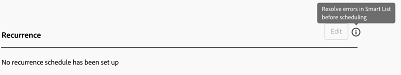

# Registerkarte „Einstellungen“ {#settings-tab}

Auf der Registerkarte Einstellungen werden alle Kampagneneinstellungen gespeichert, einschließlich der gleichen Berechtigungssätze und Zugriffsberechtigungen wie auf der Registerkarte Zeitplan in Smart-Kampagnen.

Es umfasst die folgenden drei Abschnitte.

* **Qualifizierungsregeln**: Legt fest, wie oft jede Person den Smart-Campaign-Fluss durchlaufen kann.

* **Einzeldurchgänge**: Kann verwendet werden, um einzelne Durchgänge entweder sofort oder in der Zukunft zu planen.

* **Wiederholung**: Wird zum Planen eines täglichen, wöchentlichen oder monatlichen Wiederholungsintervalls verwendet.

  

Qualifizierungsregeln stehen für alle Kampagnen (Trigger und Batch) zur Verfügung und umfassen die folgenden Einstellungen:

* Sie können bestimmen, wie oft eine Person eine Kampagne durchläuft
* Die Möglichkeit, eine nicht operative Kampagne zu blockieren, wenn die Person ihr Kommunikationslimit überschritten hat
* Die Möglichkeit, ein Personenlimit für eine Abbruchkampagne festzulegen

  

Einzelne Ausführungen können entweder für die sofortige Ausführung einer Kampagne oder für einige einmalige Ausführungen in der Zukunft verwendet werden.

>[!TIP]
>
>Es ist einfacher, das Wiederholungsmodal zu verwenden, wenn Sie eine Reihe von Kampagnen planen.

Das Modal „Wiederholung“ bietet die Möglichkeit, einen wiederkehrenden Zeitplan auf täglicher, wöchentlicher oder monatlicher Basis einzurichten. Nach der Einrichtung können Sie die nächsten drei Ausführungen auf der Registerkarte Einstellungen sehen.

Die Registerkarte Einstellungen bietet außerdem einen schnellen Überblick über Ihre Smart-Kampagne. Sie umfasst Folgendes:

* Kampagnenstatus
* Erstellt am
* Zuletzt geändert
* Smart-Listen-Modus
* Status der Smart-Liste:
   * Geschätzte Betroffene
   * Geschätzte Personen, die von E-Mails blockiert werden
   * Geschätzte Personen, die sich in einem Warteschritt befinden

Berechtigungssätze und Fehler auf der Registerkarte Einstellungen:

Alle vorhandenen Berechtigungssätze gelten für die Registerkarte Einstellungen . Wenn die Schaltfläche Bearbeiten ausgegraut ist, klicken Sie auf das Hilfesymbol, um herauszufinden, warum.

>[!NOTE]
>
>Wenn nach dem Klicken auf das Hilfesymbol „Zusätzliche Berechtigung erforderlich“ angezeigt wird, wenden Sie sich an Ihren Marketo-Administrator.

