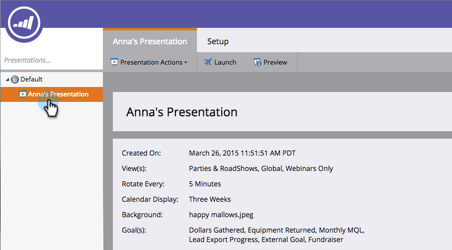

# Klonen einer Präsentation {#clone-a-presentation}

Klonen Sie eine Präsentation zur Wiederverwendung an verschiedenen Stellen.

1. Wählen Sie die Präsentation aus, die Sie klonen möchten.

   

1. Klicken Sie mit der rechten Maustaste auf die Präsentation und wählen Sie **[!UICONTROL Klonen]**.

   

1. Geben Sie einen Namen für die geklonte Präsentation ein und klicken Sie auf **[!UICONTROL Klonen]**.

   

   Sehr gut! Eine exakte Kopie Ihrer Präsentation ist jetzt vorhanden.
