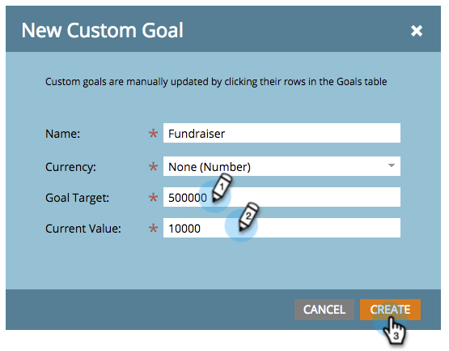

# Erstellen eines benutzerdefinierten Ziels {#create-a-custom-goal}

Ziele sind Möglichkeiten, den Fortschritt zu verfolgen und Ihr Team zu motivieren. Nach der Erstellung müssen sie manuell aktualisiert werden.

Wie Präsentationen sind Ziele [Workspace](/help/marketo/product-docs/administration/workspaces-and-person-partitions/understanding-workspaces-and-person-partitions.md)-spezifisch.

1. Navigieren Sie zum **[!UICONTROL Kalender]**.

   

1. Klicken Sie **[!UICONTROL Präsentationen]** in der rechten unteren Ecke.

   

1. Wählen Sie die **[!UICONTROL Ziele]** aus.

   

1. Ziehen Sie „Benutzerdefiniertes **[!UICONTROL &quot; per Drag-and]** Drop auf die Arbeitsfläche.

   

1. Geben Sie einen Namen für das Ziel ein. Wählen Sie eine **[!UICONTROL Währung]**.

   >[!NOTE]
   >
   >Wenn das Ziel kein Geldwert ist, können Sie &quot;**[!UICONTROL &quot;]**.

   

1. Geben Sie einen Wert für das **[!UICONTROL Ziel]** und den **[!UICONTROL aktuellen Wert]** ein (wenn es keinen gibt, geben Sie **0** ein). Klicken Sie dann auf **[!UICONTROL Erstellen]**.

   

   Ihr benutzerdefiniertes Ziel wurde erstellt!

   
