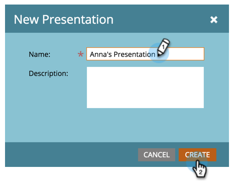

# Erstellen einer Präsentation {#create-a-presentation}

Erstellen Sie eine Präsentation, um die Kalenderansichten und Ziele Ihres Teams auf einem HDTV zu projizieren. Presentations sind Workspace-spezifisch.

>[!AVAILABILITY]
>
>
>Nicht alle Marketo Engage-Benutzer haben diese Funktion erworben. Weitere Informationen erhalten Sie beim Adobe Account Team (Ihrem Account Manager).

1. Navigieren Sie zum **[!UICONTROL Kalender]**.

   

1. Klicken Sie unten ]**rechts auf**[!UICONTROL  Presentations.

   

1. Klicken Sie **[!UICONTROL Präsentationsaktionen]** und wählen Sie **[!UICONTROL Neue Präsentation]**.

   

1. Wählen Sie einen Namen für die Präsentation. Klicken Sie auf **[!UICONTROL Erstellen]**.

   

   Gute Arbeit! Jetzt können Sie Ihre Präsentation anpassen.

>[!MORELIKETHIS]
>
>[Präsentation anpassen](/help/marketo/product-docs/core-marketo-concepts/marketing-calendar/calendar-hd/customize-a-presentation.md)
