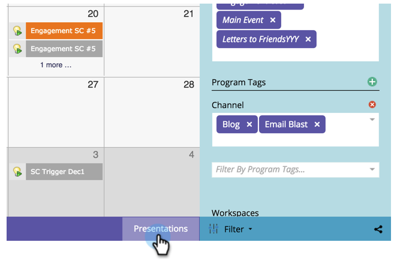

# Erstellen eines Ziels für eine intelligente Liste {#create-a-smart-list-goal}

Ziele sind Möglichkeiten, den Fortschritt zu verfolgen und Ihr Team zu motivieren. Sie können mit Smart-Listen kombiniert werden, um eine Vielzahl von Metriken in Marketo zu verfolgen. Nachdem ein Ziel für die Smart-Liste eingerichtet wurde, wird es automatisch alle zwei Stunden aktualisiert, wenn es in einer Präsentation verwendet wird.

Wie Präsentationen sind Ziele [Workspace](/help/marketo/product-docs/administration/workspaces-and-person-partitions/understanding-workspaces-and-person-partitions.md)-spezifisch.

1. Navigieren Sie zum **[!UICONTROL Kalender]**.

   

1. Klicken Sie **[!UICONTROL Präsentationen]** in der rechten unteren Ecke.

   

1. Wählen Sie die **[!UICONTROL Ziele]** aus.

   

1. Ziehen Sie „Ziel **[!UICONTROL Smart-Liste]** per Drag-and-Drop auf die Arbeitsfläche.

   

1. Geben Sie einen Namen für das Ziel ein und geben Sie ein **[!UICONTROL Ziel“]**. Klicken Sie dann auf **[!UICONTROL Erstellen]**.

   

1. [Definieren Sie die Smart-Liste](/help/marketo/product-docs/core-marketo-concepts/smart-lists-and-static-lists/creating-a-smart-list/find-and-add-filters-to-a-smart-list.md).

   

1. Nachdem die Smart-Liste konfiguriert ist, klicken Sie auf die Schaltfläche **[!UICONTROL Schließen]** und kehren Sie zur vorherigen Registerkarte zurück.

   

   Das Ziel „Smart-Liste“ wurde erstellt.

   
