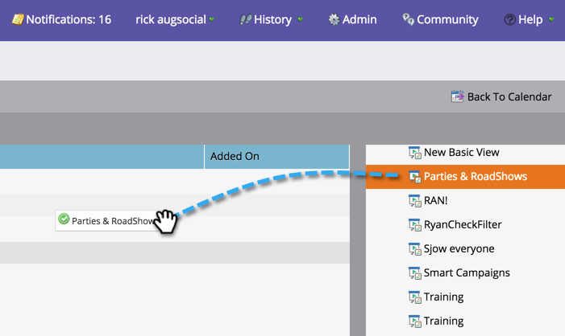
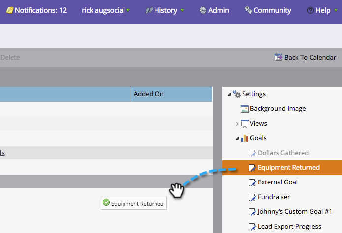
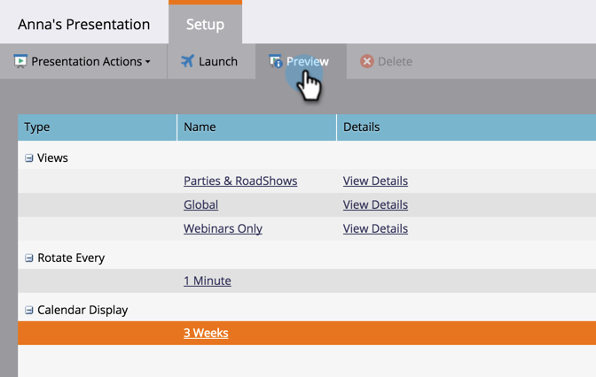

# Anpassen einer Präsentation {#customize-a-presentation}

Richten Sie Ihre Kalenderpräsentation ein, um die Ziele und Aktivitäten widerzuspiegeln, die für Ihr Team am wichtigsten sind.

>[!AVAILABILITY]
>
>
>Nicht alle Marketo Engage-Benutzer haben diese Funktion erworben. Weitere Informationen erhalten Sie vom Adobe Account Team (Ihrem Kundenbetreuer).

>[!PREREQUISITES]
>
>* [Benutzerdefinierte Ziele erstellen](/help/marketo/product-docs/core-marketo-concepts/marketing-calendar/calendar-hd/create-a-custom-goal.md){target="_blank"} oder [Ziele für intelligente Listen](/help/marketo/product-docs/core-marketo-concepts/marketing-calendar/calendar-hd/create-a-smart-list-goal.md){target="_blank"}
>
>* [Erstellen einer Präsentation](/help/marketo/product-docs/core-marketo-concepts/marketing-calendar/calendar-hd/create-a-presentation.md){target="_blank"}

## Ansichten auswählen {#choosing-the-views}

Presentations durchläuft verschiedene von Ihnen ausgewählte [Filterdefinitionen](/help/marketo/product-docs/core-marketo-concepts/marketing-calendar/working-with-the-calendar/filtering-the-marketing-calendar.md){target="_blank"}. Rufen Sie beliebig viele Ansichten auf und passen Sie die Häufigkeit an.

1. Ziehen Sie aus dem rechten Baum die verschiedenen Ansichten, die Sie in Ihrer Präsentation durchblättern möchten.

   

## Ziel hinzufügen {#add-a-goal}

Presentations ist die großartigste, wenn sie Ihre Teamziele anzeigen. Ziehen Sie einfach verschiedene [benutzerdefinierte Ziele](/help/marketo/product-docs/core-marketo-concepts/marketing-calendar/calendar-hd/create-a-custom-goal.md){target="_blank"} oder [Smart-List-Ziele](/help/marketo/product-docs/core-marketo-concepts/marketing-calendar/calendar-hd/create-a-smart-list-goal.md){target="_blank"} in den Arbeitsbereich. Sie können bis zu 10 verwenden.

1. Ziehen Sie aus dem rechten Baum verschiedene Ziele in Ihre Präsentation.

   

## Festlegen der Rotation {#set-the-frequency-of-rotation}

Nachdem Sie die Ansichten abgerufen haben, die Sie in der Präsentation wünschen, legen Sie fest, in welcher Häufigkeit sie zwischen den verschiedenen Ansichten wechseln.

1. Klicken Sie auf &quot;**[!UICONTROL 5 Minuten]**&quot;(dies ist die Standardeinstellung).

   

1. Geben Sie einen Zeitpunkt mithilfe von Minuten ein. Klicken Sie auf **[!UICONTROL Speichern]**.

   >[!NOTE]
   >
   >Zeigen Sie eine statische Ansicht an, indem Sie die Option **[!UICONTROL Drehung deaktivieren]** aktivieren.

   

## Kalenderanzeige festlegen {#set-the-calendar-display}

Die Kalenderanzeige kann in eine 3-wöchige oder monatliche Ansicht geändert werden.

1. Wählen Sie das Dropdown-Menü **[!UICONTROL Kalenderanzeige]** aus und wählen Sie zwischen **[!UICONTROL 3 Wochen]** oder einem **[!UICONTROL Monat]**.

   

   Fantastisch! Sind Sie bereit, Ihre Präsentation zu sehen?

>[!TIP]
>
>Legen Sie ein [Hintergrundbild](/help/marketo/product-docs/core-marketo-concepts/marketing-calendar/calendar-hd/add-a-background-image-to-a-presentation.md){target="_blank"} für Ihre Präsentation fest. Wir empfehlen Kätzchen oder Regenbogen.

## Vorschau einer Präsentation {#preview-a-presentation}

Sobald die Präsentation konfiguriert wurde, kann sie in der Vorschau angezeigt und gestartet werden.

1. Wählen Sie **[!UICONTROL Vorschau]** aus.

   

   Ta-da! So könnte Ihre Präsentation aussehen.

   

   Gefällt es nicht, was du siehst? Gehen Sie zurück und verwenden Sie unterschiedliche Filterdefinitionen, um die gewünschte Ansicht zu erstellen.

>[!MORELIKETHIS]
>
>* [Hinzufügen eines Hintergrundbilds zu einer Präsentation](/help/marketo/product-docs/core-marketo-concepts/marketing-calendar/calendar-hd/add-a-background-image-to-a-presentation.md){target="_blank"}
>* [Starten einer Präsentation](/help/marketo/product-docs/core-marketo-concepts/marketing-calendar/calendar-hd/launch-a-presentation.md){target="_blank"}
