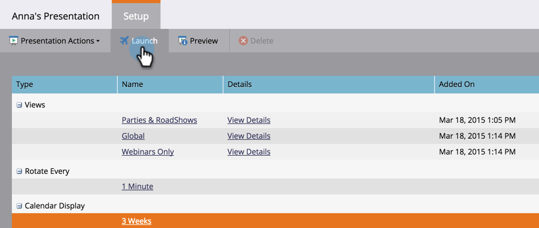

# Starten einer Präsentation {#launch-a-presentation}

Nachdem Sie die Ansichten und die Drehfrequenz für Ihre Präsentation festgelegt haben, ist es Zeit für einen Blastoff!

>[!AVAILABILITY]
>
>
>Nicht alle Marketo Engage-Benutzer haben diese Funktion erworben. Weitere Informationen erhalten Sie beim Adobe Account Team (Ihrem Account Manager).

>[!PREREQUISITES]
>
>* [Erstellen einer Präsentation](/help/marketo/product-docs/core-marketo-concepts/marketing-calendar/calendar-hd/create-a-presentation.md)
>* [Präsentation anpassen](/help/marketo/product-docs/core-marketo-concepts/marketing-calendar/calendar-hd/customize-a-presentation.md)

>[!TIP]
>
>Stellen Sie sicher _dass Sie „Vorschau einer_&quot; vor dem Start anzeigen.

1. Klicken Sie **[!UICONTROL Starten]**.

   

1. Klicken **[!UICONTROL noch]** auf „Starten“. Dadurch werden Sie von Marketo abgemeldet, damit die Präsentation sicher angezeigt werden kann.

   

   >[!TIP]
   >
   >Ihre Präsentation wird auf einer neuen Registerkarte gestartet. Verschieben Sie bei Bedarf die Registerkarte zur Anzeige auf einen externen Monitor und klicken Sie auf **[!UICONTROL Vollbild]**.
