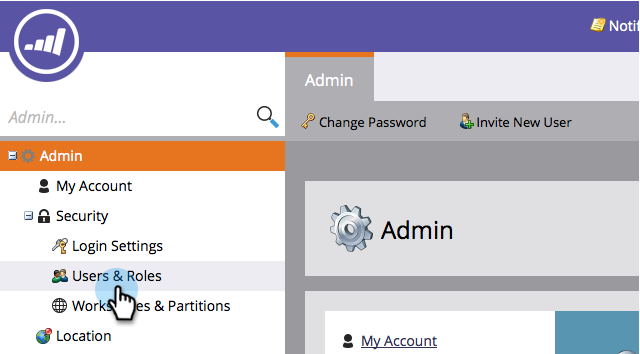
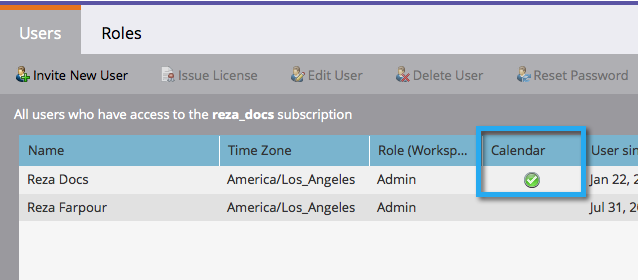

# Marketing-Kalender-Lizenz erteilen oder widerrufen {#issue-revoke-a-marketing-calendar-license}

>[!NOTE]
>
>**Admin-Berechtigungen erforderlich**

Um Ihren [Marketing-Kalender](/help/marketo/product-docs/core-marketo-concepts/marketing-calendar/understanding-the-calendar/navigating-the-marketing-calendar.md){target="_blank"} Lizenzen zu nutzen, müssen Sie Lizenzen für Benutzer ausstellen, die Zugriff benötigen.

1. Navigieren Sie zum Abschnitt **[!UICONTROL Admin]**.

   

1. Klicken Sie auf **[!UICONTROL Benutzer und Rollen]**.

   

1. Wählen Sie die Benutzer aus und klicken Sie auf **[!UICONTROL Lizenz]**.

   >[!TIP]
   >
   >Mit **Strg/Befehl+** können Sie mehrere Benutzer gleichzeitig auswählen.

   

1. Markieren Sie **[!UICONTROL Lizenz aktivieren]** und klicken Sie auf **[!UICONTROL Speichern]**.

   >[!NOTE]
   >
   >Es gibt eine Beschränkung von 5 Lizenzen. Wenn Sie weitere Informationen benötigen, wenden Sie sich an Ihren Vertriebsmitarbeiter.

   

   Das grüne Häkchen sollte jetzt unter &quot;[!UICONTROL &quot; ].

   
