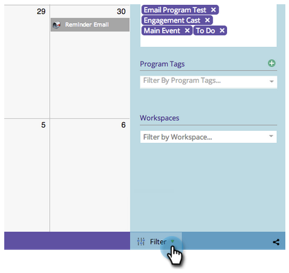
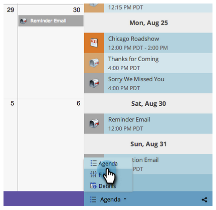
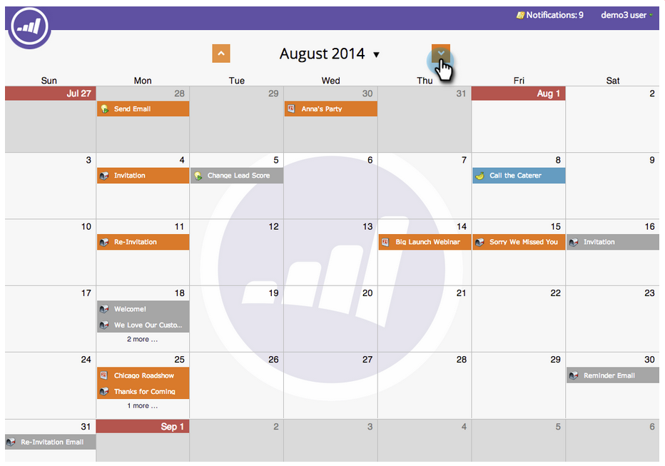

# Navigieren im Marketingkalender {#navigating-the-marketing-calendar}

Der Marketingkalender bietet sich an, einfach zu navigieren. So geht es.

>[!PREREQUISITES]
>
>Stellen Sie sicher, dass Sie [Lizenz für Marketing-Kalender](/help/marketo/product-docs/core-marketo-concepts/marketing-calendar/understanding-the-calendar/issue-revoke-a-marketing-calendar-license.md){target="_blank"} - Andernfalls wird die Kachel Marketing-Kalender nicht in My Marketo angezeigt.

>[!NOTE]
>
>Wiederkehrende Smart-Kampagnen werden im Marketingkalender nicht unterstützt.

1. Navigieren Sie zu **Marketingkalender**.

   

1. Dies ist eine Vogelperspektive-Ansicht von Assets, die in Ihrer Marketo-Instanz geplant sind.

   

## Wechsel zwischen Modi {#change-between-modes}

1. Klicken Sie auf **[!UICONTROL 3 Wochen]** oder **[!UICONTROL Monat]** Registerkarten zum Wechseln zwischen Modi.

   

## Verwenden der Agenda-Ansicht {#use-the-agenda-view}

In der Agenda-Ansicht werden alle Einträge als Liste angezeigt.

1. Klicken Sie auf **[!UICONTROL Filter]** angezeigt.

   

1. Wählen Sie die **[!UICONTROL Agenda]** anzeigen.

   

   Fantastisch! Das ist ein toller Ausblick, um alles zu sehen, was geplant ist.

   

## Navigieren durch die Zeit {#navigate-through-time}

Ohne DeLorean! Klicken Sie einfach auf die Navigationsschaltflächen.

Sie können auch diese Tastaturbefehle verwenden.

| Aktion | Tastaturbefehl |
|---|---|
| Zurück zur Zeit | Alt/Opt+Up |
| Zeitnah weiterleiten | Alt/Opt-out + Herunterfahren |
| Wechseln Sie zu &quot;heute&quot; | alt/opt + t |

Fantastisch! Das sind die Grundlagen. Sie können Ihre Ansicht auch mithilfe von Filtern anpassen.

>[!MORELIKETHIS]
>
>[Filtern des Marketing-Kalenders](/help/marketo/product-docs/core-marketo-concepts/marketing-calendar/working-with-the-calendar/filtering-the-marketing-calendar.md){target="_blank"}
