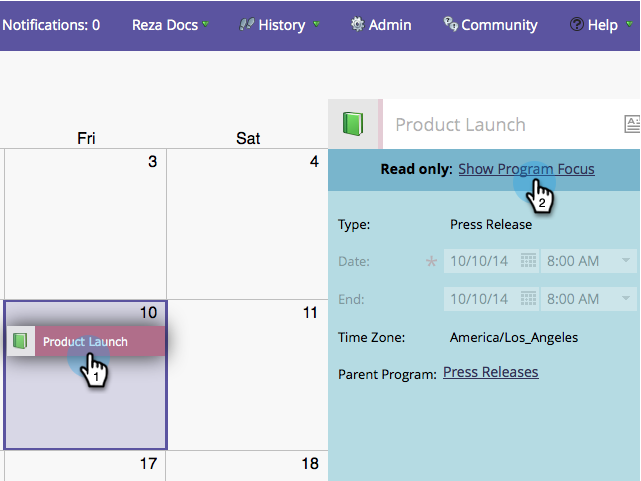

# Erstellen von Einträgen direkt im Marketingkalender {#create-entries-directly-in-the-marketing-calendar}

Marketo ermöglicht es Ihnen, Einträge direkt in Ihrem Marketingkalender mithilfe des Programmfokus-Modus zu erstellen. Sie können die folgenden Eintragstypen erstellen:

* Einfache Einträge
* Benutzerdefinierte Einträge
* E-Mail-Programme
* Intelligente Kampagnen

1. Klicken Sie auf die Kachel **[!UICONTROL Kalender]**.

   

1. Wählen Sie einen vorherigen Eintrag aus und klicken Sie auf **[!UICONTROL Programmfokus anzeigen]**.

   

1. Wählen Sie im Programmfokus-Modus den gewünschten Tag aus, um einen Eintrag hinzuzufügen.

   

1. Benennen Sie Ihren Eintrag und wählen Sie einen Typ aus.

   

   >[!TIP]
   >
   >Beachten Sie, dass Sie auf dieselbe Weise auch **Smart-Kampagnen**, **E-Mail-Programme** und **einfache Einträge** erstellen können.

1. Schließen Sie nach Abschluss der Bearbeitung den Fokusmodus des Programms.

   

>[!MORELIKETHIS]
>
>[Einträge direkt im Marketingkalender bearbeiten](/help/marketo/product-docs/core-marketo-concepts/marketing-calendar/working-with-the-calendar/edit-entries-directly-in-the-marketing-calendar.md){target="_blank"}
