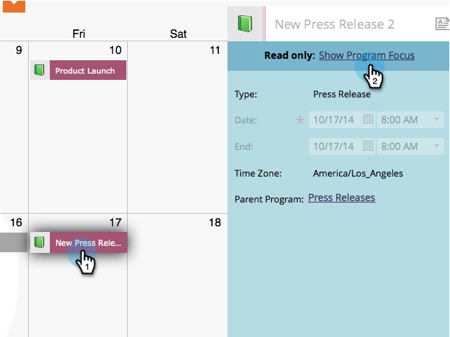

# Einträge direkt im Marketing-Kalender löschen {#delete-entries-directly-in-the-marketing-calendar}

Neben dem [ (Erstellen](/help/marketo/product-docs/core-marketo-concepts/marketing-calendar/working-with-the-calendar/create-entries-directly-in-the-marketing-calendar.md){target="_blank"} und [Bearbeiten](/help/marketo/product-docs/core-marketo-concepts/marketing-calendar/working-with-the-calendar/edit-entries-directly-in-the-marketing-calendar.md){target="_blank"} können Sie sie auch direkt im Marketing-Kalender löschen. So geht&#39;s.

1. Klicken Sie auf **Kachel** MU“.

   

1. Wählen Sie den zu löschenden Eintrag aus und klicken Sie auf **[!UICONTROL Programmfokus anzeigen]**.

   

1. Klicken Sie auf das Papierkorbsymbol.

   

Je nach Eintrag müssen Sie den Löschvorgang möglicherweise bestätigen. Aber das war&#39;s!

>[!MORELIKETHIS]
>
>[Einträge direkt im Marketing-Kalender bestätigen](/help/marketo/product-docs/core-marketo-concepts/marketing-calendar/working-with-the-calendar/confirm-entries-directly-in-the-marketing-calendar.md){target="_blank"}
