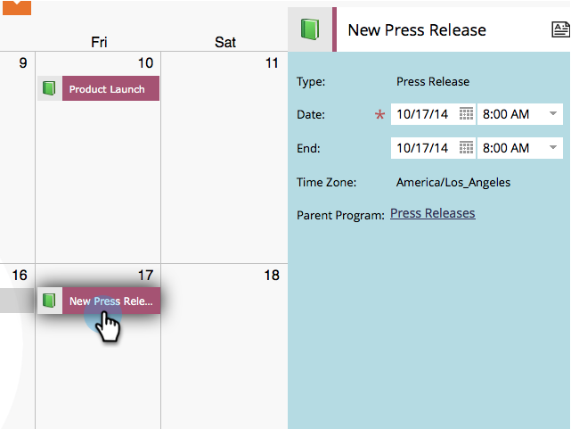
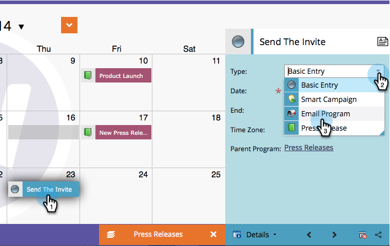
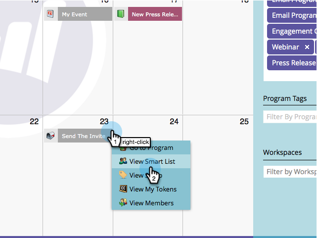

# Bearbeiten von Einträgen direkt im Marketing-Kalender {#edit-entries-directly-in-the-marketing-calendar}

Sobald Sie sich im Programmfokus-Modus befinden, können Sie schnell Änderungen an Kalendereinträgen vornehmen.

## Programmfokus aktivieren {#enable-program-focus}

1. Klicken Sie auf **[!UICONTROL Kachel]** Kalender“.

   

1. Wählen Sie einen Eintrag aus, der zu dem Programm gehört, auf das Sie den Fokus legen möchten, und klicken Sie auf **[!UICONTROL Programmfokus anzeigen]**.

   

## Eintrag neu planen {#reschedule-entry}

1. Ziehen Sie einen Eintrag per Drag-and-Drop, um ihn neu zu planen.

   

## Eintragsnamen bearbeiten {#edit-entry-name}

1. Wählen Sie den Eintrag aus, den Sie umbenennen möchten.

   

1. Namen des Eintrags bearbeiten.

   

   >[!TIP]
   >
   >Sie können auch die Beschreibung bearbeiten.
   >
   >

## Eintragstyp konvertieren {#convert-entry-type}

Nachdem Sie schnell Stifte in Ihren Grundeinträgen eingefügt haben, können Sie sie in ihre endgültige Form konvertieren.

1. Suchen und wählen Sie den zu konvertierenden Basiseintrag aus und ändern Sie seinen Typ.

   

## Eingabedetails bearbeiten {#edit-entry-details}

Sie können schnell auf verschiedene Bereiche Ihrer Einträge zugreifen und diese bearbeiten.

1. Klicken Sie mit der rechten Maustaste auf einen Eintrag und wählen Sie den Bereich aus, den Sie bearbeiten möchten.

   

Es gibt viele Dinge, die Sie direkt aus dem Marketing-Kalender tun können.

>[!MORELIKETHIS]
>
>[Einträge direkt im Marketing-Kalender löschen](/help/marketo/product-docs/core-marketo-concepts/marketing-calendar/working-with-the-calendar/delete-entries-directly-in-the-marketing-calendar.md){target="_blank"}
