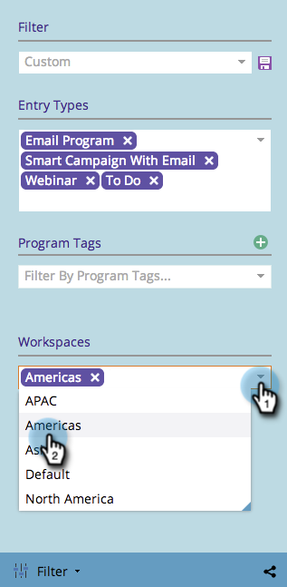

# Filtern des Marketing-Kalenders nach Arbeitsbereichen {#filtering-the-marketing-calendar-by-workspace}

Der Marketing-Kalender kann nach Objekten in bestimmten Arbeitsbereichen gefiltert werden.

1. Klicken Sie auf **[!UICONTROL Kachel]** Kalender“.

   

1. Wählen Sie im Filterbedienfeld die Dropdown-Liste **[!UICONTROL Workspace]** aus. Wählen Sie Ihren gewünschten Arbeitsbereich aus.

   

   Es werden jetzt nur Objekte angezeigt, die in diesem Arbeitsbereich erstellt wurden.

   >[!NOTE]
   >
   >[Speichern einer Filterdefinition im Marketing-Kalender](/help/marketo/product-docs/core-marketo-concepts/marketing-calendar/working-with-the-calendar/saving-a-filter-definition-in-the-marketing-calendar.md){target="_blank"}
