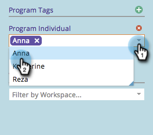

# Marketing-Kalender filtern {#filtering-the-marketing-calendar}

Verwenden Sie Eintragstypen, Programm-Tags oder Arbeitsbereiche, um die im Kalender angezeigten Informationen zu filtern.

1. Klicken Sie auf **[!UICONTROL Kachel]** Kalender“.

1. Klicken Sie auf **[!UICONTROL Dropdown-]** „Eintragstyp“.

   >[!NOTE]
   >
   >Die Standardeintragstypen sind **[!UICONTROL E-Mail]** **[!UICONTROL Programme]** und **[!UICONTROL Smart-Kampagnen mit E-Mail]**.

   

1. Wählen Sie zusätzliche Eintragstypen aus, die Sie in Ihrem Filter sehen möchten.

   

   >[!TIP]
   >
   >Beschreibungen der standardmäßigen Eintragstypen finden Sie unter [Programmplanungsansicht - Eintragstypen](/help/marketo/product-docs/core-marketo-concepts/programs/program-schedule-view/program-schedule-view-entry-types.md){target="_blank"}.

1. Wählen Sie die Programm-Tags aus, die Sie interessieren.

   

1. Wählen Sie den Tag-Wert aus.

   

   Fantastisch! Es werden jetzt nur noch Einträge angezeigt, die für den soeben definierten Filter gelten.

   >[!NOTE]
   >
   >[Speichern einer Filterdefinition im Marketing-Kalender](/help/marketo/product-docs/core-marketo-concepts/marketing-calendar/working-with-the-calendar/saving-a-filter-definition-in-the-marketing-calendar.md){target="_blank"}
