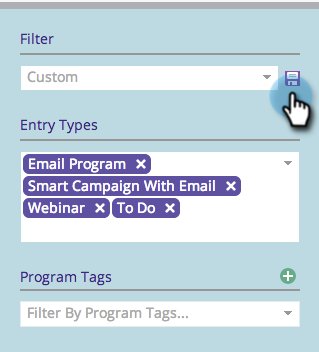

# Speichern einer Filterdefinition im Marketing-Kalender {#saving-a-filter-definition-in-the-marketing-calendar}

Durch das Speichern eines Filters können Sie zwischen verschiedenen Filterdefinitionen hin und her wechseln.

>[!PREREQUISITES]
>
>[Filtern des Marketing-Kalenders](/help/marketo/product-docs/core-marketo-concepts/marketing-calendar/working-with-the-calendar/filtering-the-marketing-calendar.md){target="_blank"}

1. Definieren Sie den Filter.

   

1. Klicken Sie auf das Speichern -Symbol.

   

1. Benennen Sie den Filter. Klicken Sie auf **[!UICONTROL Speichern]**.

   

   Der Filter wird jetzt gespeichert.

   

   Sie können bei Bedarf [eine Kopie](/help/marketo/product-docs/core-marketo-concepts/marketing-calendar/working-with-the-calendar/sharing-a-filter-definition-in-the-marketing-calendar.md){target="_blank"} der Definition an andere Marketo-Benutzer senden.

   >[!NOTE]
   >
   >[Freigeben einer Filterdefinition im Marketing-Kalender](/help/marketo/product-docs/core-marketo-concepts/marketing-calendar/working-with-the-calendar/sharing-a-filter-definition-in-the-marketing-calendar.md){target="_blank"}
