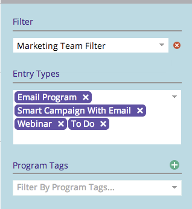

# Speichern einer Filterdefinition im Marketingkalender {#saving-a-filter-definition-in-the-marketing-calendar}

Durch Speichern eines Filters können Sie zwischen verschiedenen Filterdefinitionen hin- und herschalten.

>[!PREREQUISITES]
>
>* [Filtern des Marketingkalenders](filtering-the-marketing-calendar.md)

>

1. Definieren Sie den Filter.

   

1. Klicken Sie auf das Symbol Speichern.

   

1. Benennen Sie den Filter. Klicken Sie auf **Speichern**.

   

   Zieh dich an! Der Filter wird jetzt gespeichert.

   

   Wenn Sie möchten, können Sie [eine Kopie](sharing-a-filter-definition-in-the-marketing-calendar.md) der Definition an andere Marker senden.

   >[!NOTE]
   >
   >**Verwandte Artikel**
   >
   >    
   >    
   >    * [Freigeben einer Filterdefinition im Marketingkalender](sharing-a-filter-definition-in-the-marketing-calendar.md)

