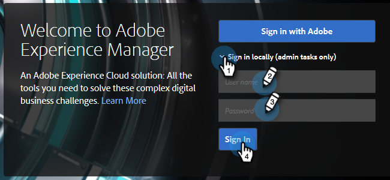

# Konfigurieren der Adobe Experience Manager-Integration {#configuring-adobe-experience-manager-integration}

Konfigurieren Sie AEM, damit Sie auf AEM Assets zugreifen, sie auswählen und in Marketo Design Studio importieren können.

>[!NOTE]
>
>**Erforderliche Administratorberechtigungen**

>[!CAUTION]
>
>Diese Funktion wird derzeit nur in Firefox vollständig unterstützt. Sie wird in Safari nicht unterstützt und funktioniert möglicherweise nicht in der neuesten Version von Chrome, je nach Ihren SameSite-Cookie-Einstellungen.

1. Navigieren Sie zur Adobe Experience Manager (die URL ist unternehmensspezifisch).

   

1. Sie können sich mit Adobe anmelden oder sich lokal anmelden. In diesem Beispiel werden wir uns lokal anmelden.

   

1. In **Instrumente** klicken **Aktivitäten** und wählen Sie **Web-Konsole**.

   

1. Suchen Sie in Ihrem Browser (Strg+f unter Windows, Befehl+F unter Mac) nach &quot;Adobe Granite Cross-Origin Resource Sharing Policy&quot;.

   

1. Klicken Sie auf **+** rechts.

   

1. Im **Zulässiger Ursprung (Regexp)** Textfeld, Eingabe `https://.*\.marketo\.com` und klicken Sie auf **Speichern**.

   

1. Klicken Sie in der Kopfzeile oben auf der Seite auf **Web-Konsole** und wählen Sie **Systeminformationen**.

   

1. Klicken Sie unter &quot;Serverinformationen&quot;auf die **Neu starten** Schaltfläche.

   

1. Klicken **OK** zur Bestätigung.

   

1. Klicken Sie in Marketo Classic auf **Admin**.

   

1. Wählen Sie unter Integration die Option **Adobe Experience Manager**.

   

1. Klicken **Bearbeiten**.

   

1. Geben Sie Ihre AEM-URL ein und klicken Sie auf **OK**.

   

   Du bist ganz fertig! Sie können jetzt [Importieren AEM Assets in Design Studio in Marketo Sky](https://experienceleague.adobe.com/docs/marketo/sky/design-studio/importing-assets-with-adobe-experience-manager.html?lang=en#design-studio).
