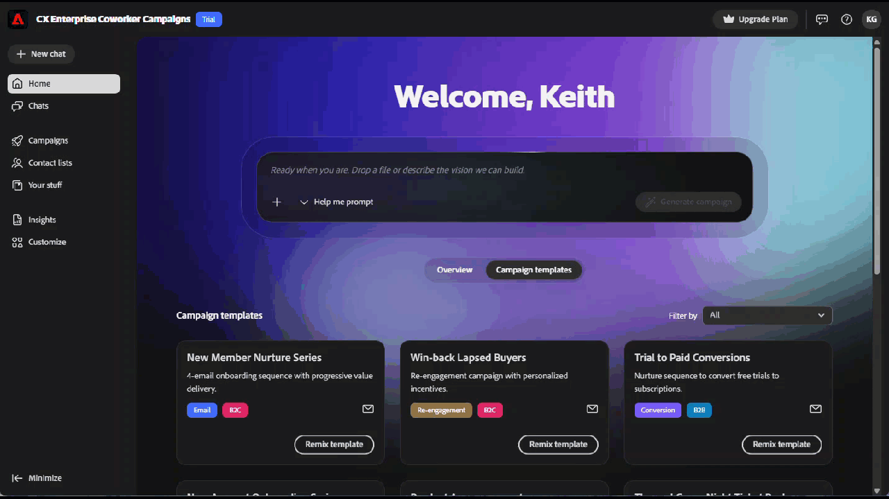

# Adobe CX Enterprise Coworker-Kampagnen - Übersicht {#overview}

Adobe CX Enterprise Coworker Campaign ist eine KI-native Marketing-Anwendung, die Sie von einer einzigen Eingabeaufforderung bis hin zu einer kompletten Kampagne zur Überprüfung bereit hält.

## Zugriff

>[!NOTE]
>
>Coworker Campaign ist über eine kostenlose Testversion bis zum 1. Oktober 2026 verfügbar. Während der Testphase sind alle Assets und Aktivitäten benutzerspezifisch.

1. Navigieren Sie zu coworker-campaigns.experience.adobe.com.

1. Melden Sie sich mit Ihrer geschäftlichen E-Mail an oder erstellen Sie ein Konto.

   Bestehende Adobe-Kunden werden automatisch genehmigt und direkt zur Testumgebung weitergeleitet, um die Bedingungen zu akzeptieren.

   Neue Benutzer werden aufgefordert, ein Konto zu erstellen. Das Team von Coworker Campaign prüft Anfragen und genehmigt geschäftliche E-Mails. Sie erhalten eine E-Mail, sobald Ihre Anfrage genehmigt wurde.

1. Akzeptieren Sie die Testbedingungen.

1. Richten Sie Ihre Marke unter **Ihr Material** > **Marken** ein. Coworker campaigns verwendet diese als Standard für jede von Ihnen generierte Kampagne.

1. (Optional) Laden Sie eine HTML-E-Mail-Vorlage unter **E-Mail-Vorlagen** hoch, damit Ihre Kampagnen-Designs beim Generieren von Inhalten angewendet werden.

   {width="800" zoomable="yes"}

Sie können jetzt Ihre erste Kampagne erstellen.

## Tour durch die Benutzeroberfläche

Die Benutzeroberfläche von Coworker Campaign ist um eine Navigation auf der linken Seite organisiert.

| Linkes Navigationsmenü | Zweck |
|---|---|
| Neuer Chat | Neue Konversation starten, um eine Kampagne zu generieren. |
| Startseite | Ihr Ausgangspunkt: Eingabeaufforderungsleiste, letzte Kampagnen und vorgefertigte Kampagnenvorlagen. |
| Chats | Jedes von Ihnen begonnene Gespräch, das noch nicht in ein Campaign-Board generiert wurde. |
| Kampagnen | Ihr Inventar aller Entwurfs- und Live-Kampagnen. |
| Ihre Sachen | Ihre Marken-Kits und E-Mail-Vorlagen (die Assets, die Coworker Campaign verwendet, um alles in Ihrer Marke zu halten). |
| Anpassen | Connectoren (Marketo Engage beim Start) und Fähigkeiten (benutzerdefinierte Verhaltensweisen, die Sie auf alle Kampagnen anwenden können). |

>[!NOTE]
>
>Bei der Einführung konzentriert sich jedes Gespräch in Coworker Campaign auf die Erstellung einer Kampagne. Ideen, Analysen und Support-ähnliche Gespräche werden nach und nach eingeführt.

## Was Sie mit Coworker-Kampagnen tun können

Coworker Campaign führt fünf Workflows zusammen, die in der Regel fünf verschiedene Tools umfassen, in einem Gesprächserlebnis:

- **Verwandeln Sie einen Brief in einen Kampagnenplan**. Wenn Sie eine Eingabeaufforderung ablegen oder eine Zusammenfassung hochladen, gibt Coworker Campaign einen strukturierten End-to-End-Plan zurück.
- **Erstellen und Verfeinern von Zielgruppen**. Laden Sie eine CSV-Datei hoch oder verbinden Sie Ihre Daten und verfeinern Sie dann das Segment in der Konversation.
- **Generieren von markeninternen Inhalten**. Coworker Campaign schreibt E-Mails, die Ihrer Markensprache, Ihren Verweisen und Vorlagen entsprechen.
- **Entwerfen Sie mehrstufige Journey**. Coworker Campaign stellt Nurture-Sequenzen zusammen, nicht nur einmalige Sendungen.
- **Testversand-E-Mails**. Zeigen Sie vor dem Start jede Nachricht in Ihrem eigenen Posteingang in der Vorschau an.
- **Starten und analysieren**. _(in Kürze verfügbar)_ Senden Sie Kampagnen und erhalten Sie Einblicke in die nächsten Schritte, ohne die Kampagnen des Kollegen verlassen zu müssen.

## Funktionsweise der KI

Coworker Campaign folgt einer einfachen, mehrgängigen Gesprächsschleife:

**Eingabe**. Sie geben ein Kampagnenziel, Ihre Zielgruppe (hochgeladen oder verbunden) und den optionalen Markenkontext an.

**Verarbeitung**. Die agentische KI von Coworker Campaign generiert einen Kampagnenplan, erstellt eine Journey und entwirft personalisierte Inhalte. All dies können Sie im Gespräch aktualisieren.

**Ausgabe**. Ein Kampagnenentwurf wird auf Ihrem Campaign-Board angezeigt und kann überprüft, iteriert und schließlich gestartet werden.

Sie können jederzeit mit Kollegen-Kampagnen sprechen (z. B. „die zweite E-Mail dringlicher gestalten“, „die Betreffzeilen verkürzen“ oder „die Zielgruppe in abgelaufene Kundinnen und Kunden aus dem 3. Quartal austauschen„) und die Artefakte im Kontext aktualisieren.

>[!CAUTION]
>
>Die Ausgaben müssen vor dem Senden immer überprüft werden.

## Tipps für die ersten Schritte

Einige Dinge, die frühe Nutzer erkannt haben, machen einen echten Unterschied:

- **Beginnen Sie mit einem bestimmten, echten Anwendungsfall**. „Erstellen Sie eine Win-Back-Serie für Kunden, die nicht in 90 Tagen bestellt haben“ Schläge „Make me a campaign.“ Siehe _Anwendungsfälle_ für spezifische Beispiele.
- **Bereinigen Sie Ihre Zielgruppendaten**. Coworker-Kampagnen können nur so personalisiert werden, wie es Ihre CSV-Datei zulässt. Schließen Sie alle Kontakte aus, die Sie vor dem Hochladen nicht per E-Mail versenden sollten.
- **Investieren Sie in Ihr Markensetup**. Coworker Campaign extrahiert Markendetails, wenn Sie sich anmelden. Eine kurze Übersicht über **Ihre Inhalte** > **Marken** kommt jeder Kampagne zugute, die Sie generieren.
- **Testversand per E-Mail durchführen**. Senden Sie vor dem Start einen Testversand und überprüfen Sie ihn in Ihrem eigenen Posteingang.
- **Iterieren, nicht neu starten**. Die erste Ausgabe von Coworker-Kampagnen als Ausgangspunkt behandeln. Der schnellste Weg zu großem Erfolg sind ein paar Runden Verfeinerung, keine neue Eingabeaufforderung.
- **Exportieren Sie , wenn Sie eine Papierspur benötigen**. Exportieren Sie einzelne E-Mails als HTML oder die gesamte Kampagne als Word-Dokument oder PDF zur Teamüberprüfung.

## Was in der Testversion verfügbar ist

Coworker Campaign ist ein Produkt, das sich in der aktiven Entwicklung befindet. Hier finden Sie Informationen zum Einstieg:

- **Testfenster**: Jetzt bis zum 1. Oktober 2026.
- **Annahme erforderlich**: Sie müssen die Testbedingungen überprüfen und akzeptieren, bevor Sie auf das Produkt zugreifen können.
- **Datenanleitung**: Laden Sie keine sensiblen oder regulierten Daten hoch. Coworker Campaign ist derzeit nicht für HIPAA-regulierte Branchen vorgesehen.
- **Compliance**: Sie sind für die Einhaltung von E-Mail-Vorschriften verantwortlich (Abmelde-Links, Datenschutzrichtlinien usw.).
- **Sendelimit**: (_in Kürze verfügbar_) Wenn Launch verfügbar ist, können Sie bis zu 5.000 E-Mails pro Monat senden.

Während der Testphase werden neue Funktionen bereitgestellt. Ihr Feedback prägt das weitere Vorgehen. Senden Sie Feedback über das Symbol für produktinternes Feedback in der Kopfzeile.
