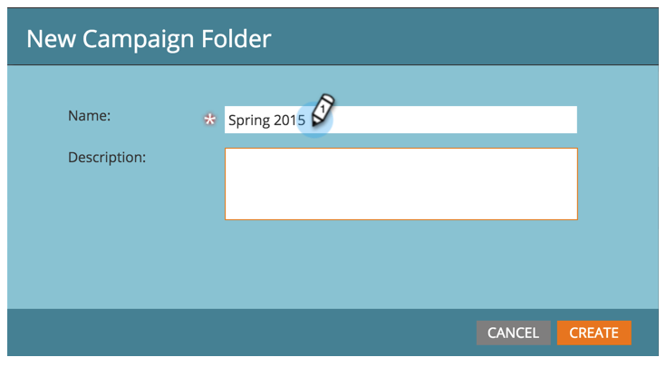
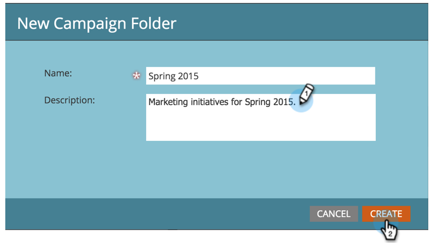

# Neuen Kampagnenordner erstellen {#create-new-campaign-folder}

Kampagnenordner helfen Ihnen, einen sauberen Arbeitsbereich aufzubewahren. Folgen Sie diesen einfachen Schritten und Sie sind auf dem Weg zur Automatisierungsmagie.

1. Navigieren Sie zu **[!UICONTROL Marketingaktivitäten]**.

   

1. Auswählen **[!UICONTROL Neu]**.

   

1. Auswählen **[!UICONTROL Neuer Kampagnenordner]**.

   

1. Geben Sie einen **[!UICONTROL Name]** für den Kampagnenordner.

   

1. Optional: Geben Sie einen **[!UICONTROL Beschreibung]** und klicken **[!UICONTROL Erstellen]**.

   >[!TIP]
   >
   >Beschreibungen richten sich an andere Benutzer des Abonnements. Ihre Kunden werden diese Nachricht nicht sehen.

   

   Fantastisch! Sie haben gerade einen Kampagnenordner erstellt. Schau es im Baum nach.

   

   Jetzt [Erstellen eines neuen Programms](/help/marketo/product-docs/core-marketo-concepts/programs/creating-programs/create-a-program.md)angezeigt, wird dieser Kampagnenordner als Option angezeigt.

>[!MORELIKETHIS]
>
>* [Programm erstellen](/help/marketo/product-docs/core-marketo-concepts/programs/creating-programs/create-a-program.md)
>* [Erstellen einer neuen Smart-Kampagne](/help/marketo/product-docs/core-marketo-concepts/smart-campaigns/creating-a-smart-campaign/create-a-new-smart-campaign.md)
