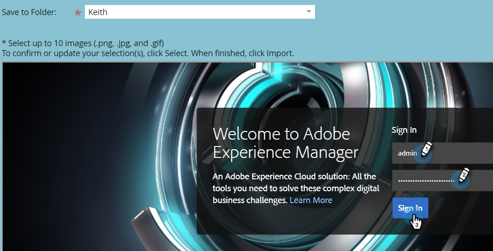

# Importieren von Assets mit Adobe Experience Manager {#importing-assets-with-adobe-experience-manager}

Mit der Asset-Auswahl können Marketo-Kunden auf AEM Assets zugreifen, sie auswählen und sie in das Design Studio von Marketo importieren. **Administratorberechtigungen sind erforderlich**.

>[!NOTE]
>
>**Verfügbarkeit**
>
>Nicht alle Kunden haben diese Funktion erworben. Weitere Informationen erhalten Sie von Ihrem Kundenbetreuer.

>[!PREREQUISITES]
>
>Vergewissern Sie sich, dass Sie die [AEM Konfiguration](https://docs.marketo.com/x/FwPLAQ) bereits durchgeführt haben.

>[!CAUTION]
>
>Diese Funktion wird derzeit nur in Firefox vollständig unterstützt. Es wird in Safari nicht unterstützt, und es funktioniert möglicherweise nicht in der neuesten Version von Chrome (Version 80), abhängig von Ihren Einstellungen für SameSite-Cookies.

1. Klicken Sie auf **Design Studio**.

   

1. Klicken Sie auf die Dropdownliste Neu und wählen Sie **Aus Adobe Experience Manager importieren**.

   

1. Wählen Sie den Ordner aus, in dem die Bilder gespeichert werden sollen.

   

1. Melden Sie sich bei Adobe Experience Manager an (falls noch nicht geschehen).

   

1. Wählen Sie Ihren Ordner aus. Wählen Sie dann die gewünschten Bilder aus, indem Sie auf die Miniaturansicht klicken (Sie können bis zu 10 wählen). Klicken Sie abschließend auf **Wählen Sie**.

   

   >[!NOTE]
   >
   >Bilder dürfen nicht größer als 100 MB sein.

1. Klicken Sie auf **Import**, um den Prozess abzuschließen.

   

   Und das ist es! Klicken Sie auf **Schließen**, um zum Design Studio zurückzukehren.

   

## Dinge zu beachten {#things-to-note}

Marketo unterstützt derzeit die Adobe Experience Manager-Versionen 6.4 und 6.5.

Alle Benutzer in Ihrer Instanz können auf die importierten Bilder zugreifen bzw. Ansichten durchführen.

Bilder werden nicht automatisch aktualisiert. Wenn ein von Ihnen in Marketing Design Studio importiertes Bild in AEM aktualisiert wird, müssen Sie es manuell erneut in Marketing importieren.
