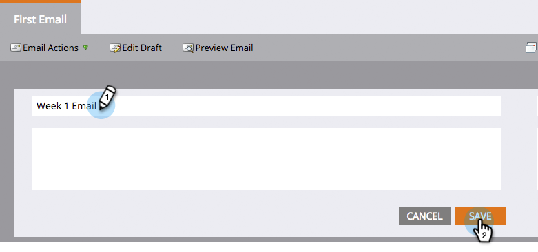

# Markieren eines Assets umbenennen {#rename-a-marketo-asset}

Ordner, Programme und lokale Assets können problemlos umbenannt werden.

1. Wählen Sie das Asset aus, das Sie umbenennen möchten, und klicken Sie auf den Namensblock des rechten Bereichs.

   

1. Geben Sie einen neuen Namen in das Textfeld ein. Klicken Sie auf **Speichern**.

   

   >[!NOTE]
   >
   >Sie können Dateien und Bilder, die hochgeladen wurden, oder Assets, auf die derzeit in einer intelligenten Liste oder intelligenten Kampagne verwiesen wird (in Filtern, Triggern, Flussschritten usw.), nicht umbenennen.

