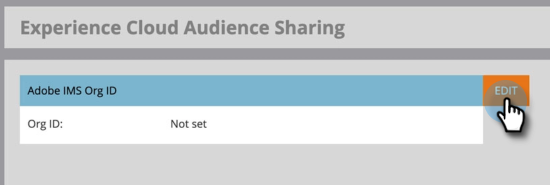

# Einrichten der Freigabe von Adobe Experience Cloud-Audiencen {#set-up-adobe-experience-cloud-audience-sharing}

Um Audience-Daten für Ihre Adobe-Anwendungen freizugeben, müssen Sie zuerst Ihre Adobe IMS Org Anmeldedaten in Marketo eingeben. So geht es.

>[!NOTE]
>
>Eine HIPAA-bereite Bereitstellung einer Marketing-Instanz kann diese Integration nicht verwenden.

1. Klicken Sie in Marketo auf **Admin**.

   

1. Klicken Sie unter &quot;Integration&quot;auf Freigabe von **Experience Cloud-Audiencen**.

   

1. Klicken Sie auf **Bearbeiten**.

   

1. Geben Sie Ihre Adobe IMS Org ID ein (erfahren Sie, wie Sie diese [hier](http://docs.adobe.com/content/help/en/control-panel/using/faq.html)finden) und klicken Sie auf **OK**.

   

1. Klicken Sie auf **Bestätigen**.

   

1. Klicken Sie auf **Schließen**.

   

   >[!NOTE]
   >
   >Aus Sicherheitsgründen müssen Sie ein Organisationsadministrator für die Adobe-Organisation sein, der Sie zugeordnet werden möchten. Wenn du nicht bist, schlägt die Aktion fehl.

1. Wenn Sie *noch* nicht angemeldet sind, wird ein Popup in einem neuen Register/Fenster angezeigt. Melden Sie sich bei Ihrer Adobe-Organisation an (bei dieser Aktion wird der Organisationszugriff überprüft).

   Und das ist es! Sie können jetzt mit der [Freigabe von Audiencen](http://docs.marketo.com/x/ogI6Ag)beginnen.

