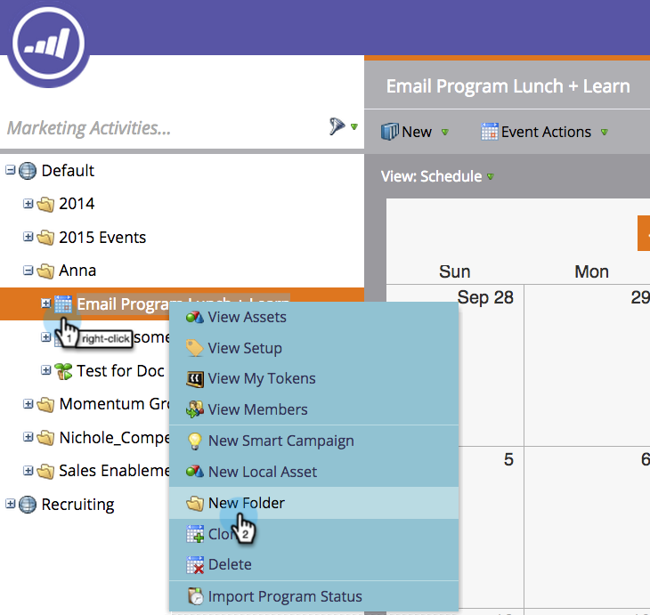
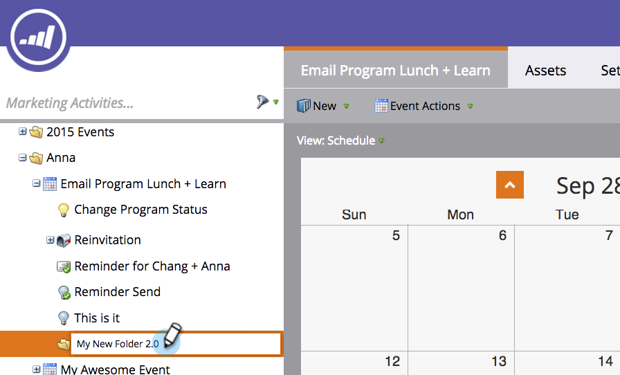

# Grundlegendes zu Ordnern {#understanding-folders}

Ordner in einem Programm können zum Organisieren von Smart-Kampagnen und Assets verwendet werden. Diese unterscheiden sich von [Kampagnenordnern](/help/marketo/product-docs/core-marketo-concepts/miscellaneous/create-new-campaign-folder.md).

## Erstellen eines Ordners {#create-a-folder}

1. Navigieren Sie zum Bereich **[!UICONTROL Marketing-Aktivitäten]**.

   

1. Klicken Sie mit der rechten Maustaste auf ein Programm und wählen Sie **[!UICONTROL Neuer Ordner]**.

   

1. Benennen Sie den neuen Ordner und drücken Sie die **[!UICONTROL Eingabetaste]**.

   

Der neue Ordner ist jetzt für Ihre lokalen Assets bereit.

## Umbenennen eines Ordners {#rename-a-folder}

1. Klicken Sie mit der rechten Maustaste auf den Ordner und wählen Sie **[!UICONTROL Ordner umbenennen]**.

   

1. Geben Sie einen neuen Namen ein und drücken Sie die **[!UICONTROL Eingabetaste]**.

   

## Löschen eines Ordners {#delete-a-folder}

>[!NOTE]
>
>Stellen Sie sicher, dass der Ordner leer ist, bevor Sie ihn löschen.

1. Klicken Sie mit der rechten Maustaste auf den Ordner und wählen Sie **[!UICONTROL Ordner löschen]**.

   

## Ordner archivieren {#archive-a-folder}

In Marketo haben Sie die Möglichkeit, vorhandene Ordner in Archivordner zu konvertieren. Archivordner sind in [!UICONTROL Marketing-Aktivitäten], [!UICONTROL Datenbank] und [!UICONTROL Design Studio] vorhanden.

Beim Archivieren eines Ordners:

* Der Ordner und die Assets sind nicht mehr in den Suchergebnissen sichtbar. Wenn Sie in einem archivierten Ordner nach einem Programm oder Ereignis suchen, geben die Ergebnisse eine reduzierte Ansicht des archivierten Ordners zurück
* Die Assets im Ordner werden nicht mehr in automatisch vorgeschlagen angezeigt
* Archivierte Vorlagen sind beim Erstellen einer E-Mail oder Landingpage in Design Studio nicht verfügbar
* Archivierte Seiten können nicht in Testgruppen für Landingpages verwendet werden

Funktionalität, die sich bei **Archivierung** ändert:

* Die globale Suche findet weiterhin Ergebnisse in archivierten Ordnern
* Sie können einen Filter verwenden, um archivierte Assets zur Verwendung in Berichten auszuwählen

### Smart Campaign bei Archivierung deaktiviert {#disable-smart-campaigns-archive}

Wenn ein Ordner oder ein Programm archiviert wird oder eine aktive Smart-Kampagne in einen bereits archivierten Ordner verschoben wird, verhindert Marketo Engage die Ausführung der betroffenen Kampagnen:

* **Ausgelöste Kampagnen** sind deaktiviert.
* **Batch-Kampagnen** deren ausstehende Ausführungen abgebrochen wurden.
* **Ausführbare Kampagnen** haben keinen Ausführungsstatus, sodass keine Aktion durchgeführt wird.

**Unterstützte Aktionen**

Die folgenden Aktionen deaktivieren Kampagnen:

* Ziehen eines Ordners **Ordner** mit aktiven Kampagnen in einen archivierten Ordner
* Ziehen eines (**)** Typs mit aktiven Kampagnen per Drag-and-Drop in einen archivierten Ordner
* Ziehen einer (einzelnen **intelligenten Kampagne** in einen archivierten Ordner
* Rechtsklick auf **Verschieben** auf einer einzelnen Smart-Kampagne in einen archivierten Ordner
* Rechtsklick auf **Ordner verschieben** auf einen Ordner mit aktiven Kampagnen in einen archivierten Ordner
* Rechtsklick auf **Verschieben** eines Programms mit aktiven Kampagnen in einen archivierten Ordner
* Rechtsklick auf **Ordner** In archivierten Ordner konvertieren), um ihn an einem Ort zu archivieren, ohne ihn zu verschieben

>[!NOTE]
>
>Wenn eine Smart-Kampagne im archivierten Ordner oder Programm an einer anderen Stelle referenziert wird (z. B. über den Flussschritt „Kampagne anfragen„), wird die Archivierung blockiert, um zu verhindern, dass die andere Kampagne beschädigt wird.
