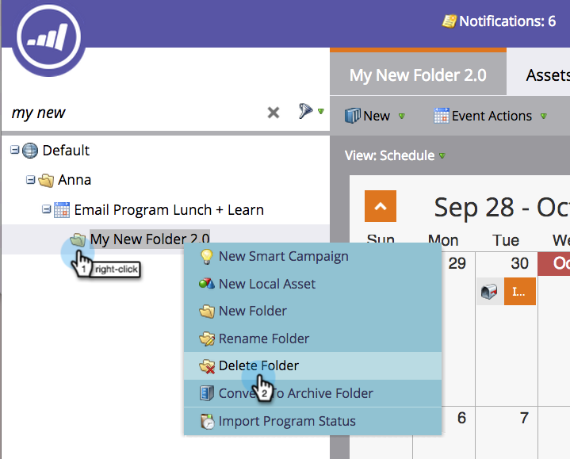

# Grundlegendes zu Ordnern {#understanding-folders}

Ordner in einem Programm können zum Organisieren von Smart-Kampagnen und Assets verwendet werden. Diese unterscheiden sich von [Kampagnenordnern](/help/marketo/product-docs/core-marketo-concepts/miscellaneous/create-new-campaign-folder.md).

## Erstellen eines Ordners {#create-a-folder}

1. Navigieren Sie zum Bereich **[!UICONTROL Marketing]** Aktivitäten.

   

1. Klicken Sie mit der rechten Maustaste auf ein Programm und wählen Sie **[!UICONTROL Neuer Ordner]**.

   

1. Benennen Sie den neuen Ordner und drücken Sie die **[!UICONTROL Eingabetaste]**.

   

Sehr gut! Jetzt verfügen Sie über einen neuen Ordner, in dem Sie Ihre lokalen Assets speichern können.

## Ordner umbenennen {#rename-a-folder}

Es ist in Ordnung, seine Meinung zu ändern.

1. Klicken Sie mit der rechten Maustaste auf den Ordner und wählen Sie **[!UICONTROL Ordner umbenennen]**.

   

1. Geben Sie einen neuen Namen ein und drücken Sie die **[!UICONTROL Eingabetaste]**.

   

## Löschen eines Ordners {#delete-a-folder}

>[!NOTE]
>
>Stellen Sie sicher, dass der Ordner leer ist, bevor Sie ihn löschen.

1. Klicken Sie mit der rechten Maustaste auf den Ordner und wählen Sie **[!UICONTROL Ordner löschen]**.

   

## Archivieren von Ordnern {#archive-a-folder}

In Marketo haben Sie die Möglichkeit, vorhandene Ordner in Archivordner zu konvertieren. Archivordner sind in Marketing-Aktivitäten, in der Datenbank und in Design Studio vorhanden.

Beim Archivieren eines Ordners:

* Der Ordner und die Assets sind nicht mehr in den Suchergebnissen sichtbar. Wenn Sie nach einem Programm oder Ereignis suchen, das sich in einem archivierten Ordner befindet, geben die Ergebnisse eine reduzierte Ansicht des archivierten Ordners zurück
* Die Assets im Ordner werden nicht mehr in automatisch vorgeschlagen angezeigt
* Archivierte Vorlagen sind beim Erstellen einer E-Mail oder Landingpage in Design Studio nicht verfügbar
* Archivierte Seiten können nicht in Testgruppen für Landingpages verwendet werden

Funktionalität, die sich bei **Archivierung** ändert:

* Die globale Suche findet weiterhin Ergebnisse in archivierten Ordnern
* Ein Asset, das verwendet wird, funktioniert auch nach der Archivierung weiter
* Sie können einen Filter verwenden, um archivierte Assets zur Verwendung in Berichten auszuwählen
* Archivierte Assets werden nicht deaktiviert. Sie müssen auch deaktiviert werden, wenn sie nicht mehr ausgeführt werden sollen
