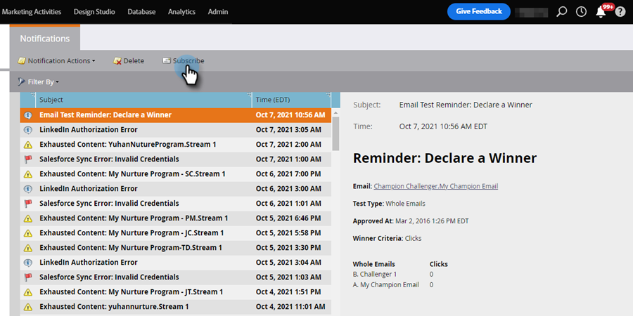

# Grundlegendes zu Benachrichtigungen {#understanding-notifications}

Benachrichtigungen halten Sie über Systemereignisse in Ihrem Marketo Engage-Abonnement auf dem Laufenden. Beispielsweise informieren Sie Benachrichtigungen zu Kampagnenfehlern über Fehler in Ihren Smart-Kampagnen, und CRM-Synchronisierungsbenachrichtigungen informieren Sie über kritische Probleme, die bei der CRM-Synchronisierung festgestellt wurden (z. B. falsche Berechtigungen oder Abbruch der Synchronisierung).

## Überblick {#overview}

1. Neue Benachrichtigungen werden oben links in Marketo Engage angezeigt.

   

1. Klicken Sie auf _Benachrichtigungen_, um alle Ihre Benachrichtigungen anzuzeigen.

   {width="800" zoomable="yes"}

## Benachrichtigungen abonnieren {#subscribe-to-notifications}

Sie können Benachrichtigungen abonnieren, um sie in Ihrer E-Mail zu erhalten.

1. Klicken Sie _Bildschirm_ Benachrichtigungen“ auf **[!UICONTROL Abonnieren]**.

   

1. Wählen Sie _Benachrichtigungstyp_ und _Workspace_. Geben Sie die E-Mail-Adresse ein, an die Benachrichtigungen gesendet werden sollen (Sie können mehrere Adressen hinzufügen, durch ein Komma getrennt). Klicken Sie abschließend **[!UICONTROL Abonnieren]**.

   

>[!NOTE]
>
>Das Feld _[!UICONTROL Senden an]_ dient nur zur Eingabe einer E-Mail-Adresse. Es wird keine Liste der vorhandenen Abonnenten angezeigt.

In einigen Fällen enthält eine Benachrichtigung einen Link „Vollständige Liste anzeigen“, über den Sie eine CSV-Datei (kommagetrennte Werte) herunterladen können, z. B. die Microsoft Dynamics-Synchronisierungsfehlerdatei. Marketo Engage bewahrt diese CSV-Dateien 30 Tage lang auf. Wenn Sie versuchen, die Datei nach 30 Tagen herunterzuladen, erhalten Sie einen 404-Fehler.

>[!TIP]
>
>Möchten Sie sich von Benachrichtigungs-E-Mails abmelden? Kein Problem. Klicken Sie einfach auf **[!UICONTROL Link]** Abo von Benachrichtigungen beenden“ am unteren Rand der Benachrichtigungs-E-Mail.
