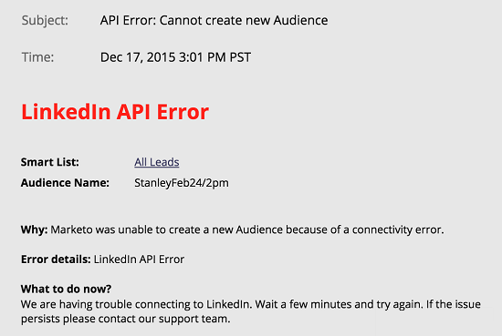

# Benachrichtigungstypen {#notification-types}

Es gibt verschiedene Arten von Benachrichtigungen.

## Kampagnenfehler  {#campaign-failure}

Kampagnenfehler informieren Sie über Fehler in Ihren Smart-Kampagnen.

## CRM-Synchronisierung {#crm-sync}

CRM-Synchronisierungsbenachrichtigungen informieren Sie über kritische Probleme, die bei der CRM-Synchronisierung festgestellt wurden, z. B. falsche Berechtigungen oder dass die Synchronisierung unterbrochen wird.

**[!DNL Microsoft Dynamics]**

[!DNL Dynamics]-Benachrichtigungen werden einmal alle 24 Stunden gesendet und enthalten Leads, die in diesem Zeitraum nicht synchronisiert werden konnten. Typische Fehlerursachen sind doppelte Leads (wie oben) oder Fehler wegen nicht übereinstimmender Feldlängen.

**[!DNL Salesforce]**

Wenn Sie [!DNL Salesforce] verwenden, sehen die Benachrichtigungen zu Synchronisierungsfehlern etwa wie folgt aus. Typische Fehler sind abgelaufene Anmeldeinformationen und Überschreitungen von API-Limits.

## Interaktion {#engagement}

Wenn ein Stream die volle Popularität erzeugt, senden wir eine Benachrichtigung. Die Benachrichtigung enthält die Anzahl der Personen, die erschöpft wurden, und einige andere Informationen.

## Facebook {#facebook}

Wenn Sie versuchen, Personen zu Facebook zu senden, ohne die Nutzungsbedingungen zu akzeptieren, oder wenn Sie versuchen, Personen nach dem Entfernen der Marketo-App an Facebook zu senden.

## Leerlauf-Auslöser-Kampagnenbereinigung {#idle-trigger-campaign-cleanup}

Ausgelöste Smart-Kampagnen deaktivieren, die keine Aktivität mehr erhalten. Weitere Informationen über [automatische Trigger-Kampagnenbereinigung](/help/marketo/product-docs/core-marketo-concepts/smart-campaigns/using-smart-campaigns/automatic-trigger-campaign-cleanup.md).

## LinkedIn {#linkedin}

Wenn Marketo nach drei Versuchen nicht in der Lage ist, eine neue Zielgruppe zu erstellen, sich anzumelden oder E-Mails an LinkedIn zu senden.

## Webdienste {#web-services}

Sie werden benachrichtigt, wenn Sie Ihr tägliches Kontingent erreichen. Das Kontingent wird jede Nacht um Mitternacht, Central Time, zurückgesetzt.

>[!NOTE]
>
>Einige der Fehler-Codes, die Sie möglicherweise erhalten, sind in unserer [Entwicklerdokumentation“ ](https://experienceleague.adobe.com/en/docs/marketo-developer/marketo/rest/error-codes).
