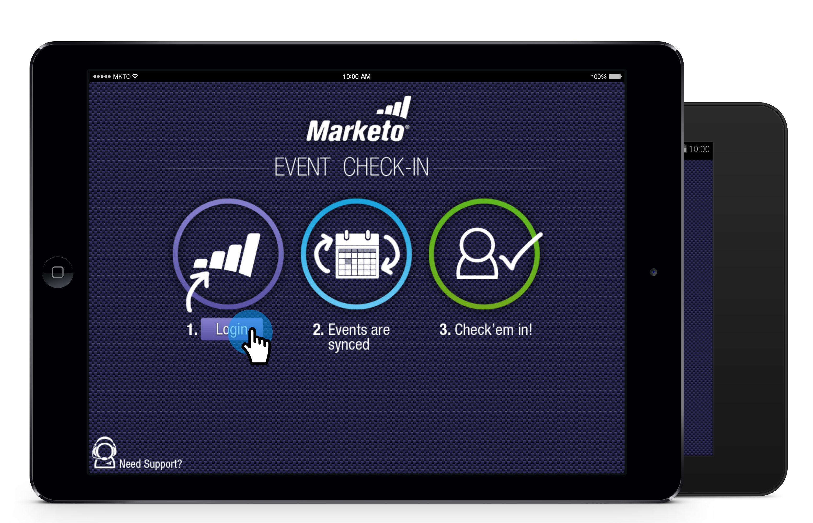

# Personen von Ihrem Tablet in Ihr Ereignis einchecken {#check-people-into-your-event-from-your-tablet}

Wenn Personen in Ihrem Ereignis angezeigt werden, finden Sie deren Informationen in der App. Nach dem Check-in werden sie beim Synchronisieren mit Marketo zum Status &quot;Beendet&quot;befördert.

Die App funktioniert auf dem iPad und Android gleich, mit Ausnahme kleinerer Layout- und Designunterschiede.

>[!PREREQUISITES]
>
>* Erstellen Sie ein Ereignis in Marketo und füllen Sie es mit eingeladenen und registrierten Personen aus.
>* Herunterladen der Tablet-App für [Android](https://play.google.com/store/apps/details?id=com.marketo.eventcheckin&amp;hl=en) oder [iOS](https://itunes.apple.com/us/app/marketo-events/id522766637?mt=8)

>

## Registrierte Gäste einchecken {#check-in-registered-guests}

1. Tippen Sie auf das App-Symbol auf Ihrem iPad oder Android-Tablet.
1. Tippen Sie auf **Anmelden** , um die Marketing Ereignis-App zu starten.

   

1. Geben Sie Ihren Benutzernamen und Ihr Passwort ein und klicken Sie auf **Anmelden**.

   >[!NOTE]
   >
   >Sie müssen über eine Rolle mit Zugriff auf die Datenbank verfügen, um Benutzer in der App anzuzeigen.

1. Wählen Sie ein **Ereignis** aus.

   

   >[!TIP]
   >
   >Es werden nur Ereignis-Programms (mit Ausnahme von Webinaren) angezeigt, die eine Woche vor und eine Woche nach dem heutigen Datum geplant sind.

1. Suchen Sie auf dem Startbildschirm nach registrierten Gästen. Um eine Person in der Liste zu finden, können Sie:

   * Scrollen, um einen Namen zu suchen
   * Geben Sie einen Namen in das Suchfeld ein
   * Springen Sie zu einem bestimmten Anfangsbuchstaben des Nachnamens, indem Sie auf der rechten Seite der Liste darauf tippen

   >[!NOTE]
   >
   >Der Vorgang ist auf dem iPad und Android gleich, aber die Bildschirme unterscheiden sich, und Elemente können sich an unterschiedlichen Positionen befinden. Dieser Artikel enthält die iPad-Oberfläche. Vergleichen Sie den Android-Bildschirm in diesem Abschnitt als Referenz.

   **iPad** 

   **Android**

   

1. Tippen Sie auf den ausgewählten Namen und dann auf dem Personaldatensatz auf **Einchecken**.

   

Der Gast hat jetzt den Status &quot;Angenommen&quot;und erhält ein Häkchen. Der Personendatensatz wird bei der Synchronisierung mit Marketo aktualisiert. Der rote Zähler auf der Synchronisierungsschaltfläche wird inkrementiert, um die Anzahl der Check-ins seit der letzten Synchronisierung mit Marketo anzuzeigen. Die Schaltfläche &quot;Synchronisieren&quot;sieht anders aus und befindet sich für iPad und Android an einem anderen Speicherort:

**iPad**

**Android**

>[!TIP]
>
>Wenn eine Person eingeladen wurde, sich aber nicht registriert hat, können Sie nach dem Namen suchen, indem Sie direkt unterhalb des Suchfelds auf **Suche auf Server** klicken. Der Status &quot;Eingeladen&quot;ändert sich für das Ereignis in &quot; **Angenommen** &quot;.

## Neue Person auf dem Tablet erstellen {#create-a-new-person-on-the-tablet}

Sie können Gäste, die keine Personen sind, manuell in Ihre Marketo-Datenbank aufnehmen. Sie werden automatisch eingecheckt und Ihrer Datenbank hinzugefügt, wenn Sie mit Marketo synchronisieren.

1. Klicken Sie auf **Hinzufügen**.

   **iPad**

   

   **Android**

   

1. Füllen Sie so viele grundlegende Informationsfelder wie möglich aus und tippen Sie auf **Fertig**.

   

   >[!NOTE]
   >
   >Sie können nur die vorhandenen Felder verwenden. Sie können keine benutzerdefinierten erstellen.

   >[!CAUTION]
   >
   >Überprüfen Sie die E-Mail-Adresse bei der Dublette. Andere Felder können später korrigiert werden, aber die E-Mail-Adresse ist die primäre Methode, um den Gast zu kontaktieren.

Die neue Person wird als bei Ihrem Ereignis eingecheckt registriert und wird bei der Synchronisierung mit Marketo der Datenbank &quot;Marketo&quot;mit dem Status &quot;Beendet&quot;hinzugefügt.

## Checkin umkehren {#reverse-a-check-in}

Wenn Sie versehentlich eine Person eingecheckt haben, *bevor Sie mit Marketo* synchronisiert wurden, können Sie den Status &quot;Teilnehmer&quot;rückgängig machen.

1. Tippen Sie auf den Namen in der Liste und im Personensatz auf **Rückgängig**.

   

   Alles fest!

## Einen Personendatensatz beim Check-In bearbeiten {#edit-a-person-record-at-check-in}

Sie können Gastinformationen direkt am Ereignis hinzufügen und ändern!

1. Tippen Sie auf den Namen in der Liste &quot;Personen&quot;und dann auf **&quot;Bearbeiten&quot;**.

   

1. Bearbeiten Sie die Felder und fügen Sie Informationen hinzu. Tippen Sie dann auf **Fertig**.

   

   >[!NOTE]
   >
   >In Android ist die Schaltfläche &quot; **Fertig** &quot;möglicherweise ausgeblendet. Blättern Sie nach unten, um es zu finden.

Die Informationen werden aktualisiert, wenn Sie die App mit Marketo synchronisieren.

## App mit Marketo synchronisieren {#sync-the-app-with-marketo}

Die Marketing Ereignisses-App funktioniert unabhängig, bis Sie Ihre Aktivität wieder mit der Marketo-Datenbank synchronisieren. Es ist am besten, so bald wie möglich nach dem letzten Check-in zu synchronisieren. Ihr Tablet muss mit dem Internet verbunden sein.

>[!CAUTION]
>
>Nach der Synchronisierung können Sie einen Check-in nicht mehr in der App rückgängig machen.

1. Öffnen Sie auf Ihrem Tablet die App und navigieren Sie zu Ihrem Ereignis.
1. Tippen Sie auf **Synchronisieren**.

   Ihr Ereignis wird mit neuen Check-ins in der Marketo-Datenbank aktualisiert. Der rote Zähler auf der Schaltfläche &quot;Synchronisieren&quot;wird gelöscht, bis Sie einen anderen Benutzer einchecken.

   Aus Sicherheitsgründen sollten Sie die Marketing Ereignisses-App beenden, nachdem Sie die Synchronisierung abgeschlossen haben.

## Arbeiten mit eingeschränktem Internetzugang {#working-with-limited-internet-access}

Einige Veranstaltungsorte haben einen lausigen Internetzugang. Sie benötigen eine gute Verbindung zu:

* Herunterladen und Installieren der App
* Anmelden
* Ereignis auswählen
* App mit Marketo synchronisieren

Wenn Sie sich wegen des Internetzugangs am Veranstaltungsort Sorgen machen, können Sie sich bei der Marketing Ereignisses-App anmelden und Ihr Ereignis im Voraus an einem Ort mit starkem Internetzugang auswählen. Auf diese Weise können Sie die App weiterhin offline verwenden. Wenn Sie dann wieder eine Internetverbindung herstellen, synchronisieren Sie diese sofort mit der Marketo-Datenbank.

>[!TIP]
>
>Wenn Sie keine Internetverbindung haben, können Sie dennoch eine neue Person für eine Person erstellen, die sich anmeldet. Es wird mit der vorhandenen Person abgeglichen, wenn Sie die App synchronisieren.

>[!NOTE]
>
>Die App meldet Sie nach acht Stunden Inaktivität automatisch ab.

