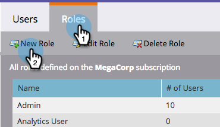
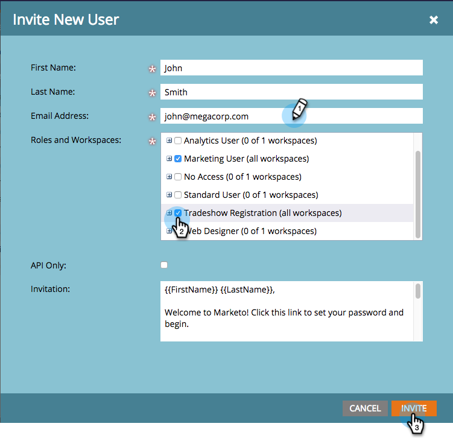

# Gewähren von Benutzerzugriff auf die App zum Einchecken {#grant-users-access-to-the-check-in-app}

Marketo Engage verfügt über eine spezielle Benutzerrolle für die Ereignis-Check-in-App. So erstellen Sie eine neue Rolle mit der Berechtigung zur Verwendung der App.

>[!IMPORTANT]
>
>Am 2. Oktober 2023 hat Adobe die Marketo Events App aus allen App Stores entfernt. Wenn Sie die App bereits auf Ihrem Tablet/Mobilgerät installiert haben, können Sie sie vorerst weiter verwenden. Nachdem Ihre Marketo Engage-Instanz zur Authentifizierung von Marketo zu Adobe Identity migriert wurde, können Sie nicht mehr auf die App zugreifen. [Weitere Informationen](https://nation.marketo.com/t5/product-discussions/marketo-events-app-and-marketo-moments-app-end-of-life/m-p/340712/highlight/true#M193869){target="_blank"}.

## Erstellen einer neuen Benutzerrolle für Mobile Apps {#create-a-new-user-role-for-mobile}

1. Klicken Sie auf **[!UICONTROL Admin]**.

   

1. Klicken Sie auf **[!UICONTROL Benutzer und Rollen]**.

   

1. Klicken Sie auf die **[!UICONTROL Rollen]** und dann auf **[!UICONTROL Neue Rolle]**.

   

1. Geben Sie einen Namen für die neue Rolle und eine optionale Beschreibung ein. Markieren Sie das **[!UICONTROL Zugriff auf Mobile App]** und klicken Sie auf **[!UICONTROL Erstellen]**.

   

   Die neue Rolle kann jetzt zugewiesen werden, wenn Sie Personen zur Verwendung der Tablet-App einladen.

## Neue Benutzer für die Check-in-App einladen {#invite-new-users-for-the-check-in-app}

1. Klicken Sie auf **[!UICONTROL Registerkarte]** Benutzer“.

   

1. Klicken Sie **[!UICONTROL Neuen Benutzer einladen]**.

   

1. Geben Sie die Informationen für den neuen Benutzer ein. Aktivieren Sie die Kontrollkästchen für alle entsprechenden Rollen und die neue Rolle mit der Berechtigung für den Zugriff auf die Mobile App. Klicken Sie **[!UICONTROL Einladen]** wenn Sie fertig sind.

   

   >[!CAUTION]
   >
   >Benutzer, die keinen Zugriff auf die Datenbank haben, können keine Personen in der App sehen.

   >[!TIP]
   >
   >Bestehenden Benutzerinnen und Benutzern können Sie entweder eine neue Rolle erstellen oder die Berechtigung [!UICONTROL Zugriff auf Mobile App] zur aktuellen Rolle hinzufügen.

Der/die Benutzende erhält eine E-Mail, in der er/sie über Zugriff auf die Check-in-App verfügt.
