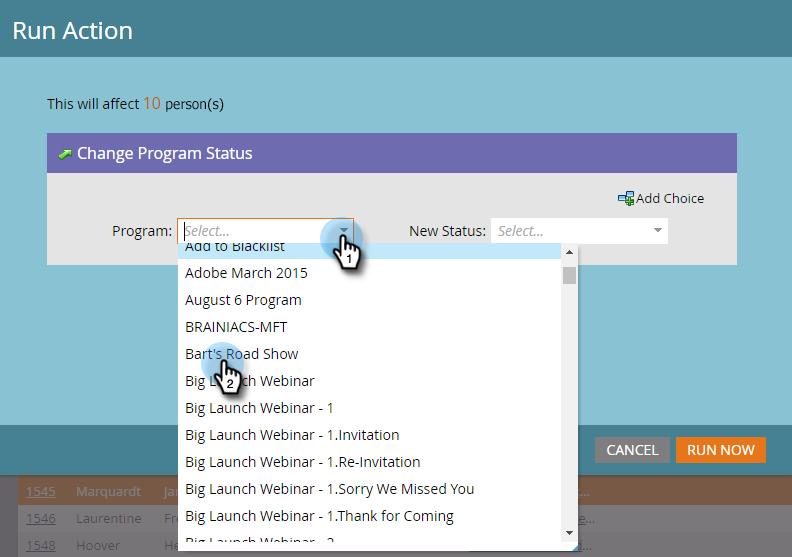
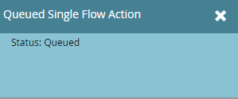

# Vorbereiten des Ereignisses {#prepare-for-your-event}

Es gibt mehrere Dinge, die Sie tun müssen, um sich für die Veranstaltung vorzubereiten.

>[!IMPORTANT]
>
>Am 2. Oktober 2023 hat Adobe die Marketo Events App aus allen App Stores entfernt. Wenn Sie die App bereits auf Ihrem Tablet/Mobilgerät installiert haben, können Sie sie vorerst weiter verwenden. Nachdem Ihre Marketo Engage-Instanz zur Authentifizierung von Marketo zu Adobe Identity migriert wurde, können Sie nicht mehr auf die App zugreifen. [Weitere Informationen](https://nation.marketo.com/t5/product-discussions/marketo-events-app-and-marketo-moments-app-end-of-life/m-p/340712/highlight/true#M193869){target="_blank"}.

## Erstellen einer neuen Marketo-Rolle {#create-a-new-marketo-role}

Marketo verfügt über eine spezielle Benutzerrolle für die Ereignis-Check-in-App. [Erstellen Sie eine neue Marketo](/help/marketo/product-docs/core-marketo-concepts/mobile-apps/event-check-in/grant-users-access-to-the-check-in-app.md)Rolle für [!DNL iPad] oder [!DNL Android] Benutzer mit der Berechtigung zum Zugriff auf die Mobile App.

## Neue Tablet-Benutzer zur Veranstaltung einladen {#invite-new-tablet-users-to-the-event}

[Laden Sie neue Tablet-Benutzer zum Ereignis ](/help/marketo/product-docs/core-marketo-concepts/mobile-apps/event-check-in/grant-users-access-to-the-check-in-app.md) und weisen Sie ihnen die neue Rolle zu.

## Erstellen eines neuen Marketo-Veranstaltungsprogramms {#create-a-new-marketo-event-program}

[Erstellen Sie ein neues Marketo-](/help/marketo/product-docs/demand-generation/events/understanding-events/create-a-new-event-program.md), um den Status Ihrer Mitarbeiter während der verschiedenen Phasen zu erfassen und genaue Messwerte des ROI für Ihre Marketing-Initiativen zu erhalten.

## Ereignisdaten angeben {#specify-the-event-dates}

Es ist ein Kinderspiel, Ihre Veranstaltungstermine festzulegen.

1. Klicken Sie auf das Ereignis im Zeitplan und legen Sie das Start- und Enddatum sowie die Uhrzeit fest.

   

1. Bewegen Sie den Mauszeiger über die **[!UICONTROL (]**) zu **[!UICONTROL Bestätigt]**.

   

   >[!CAUTION]
   >
   >Wenn das Ereignisdatum mehr als eine Woche vor oder nach dem aktuellen Datum liegt, wird Ihr Ereignis nicht in der App angezeigt. **Tipp**: Um sie zu testen, setzen Sie die Datumsangaben vorübergehend auf einen Zeitraum von weniger als einer Woche ab heute. Denken Sie daran, das Ereignis nach dem Testen an die richtigen Daten zurückzugeben.

## Personen zu Ihrer Veranstaltung hinzufügen {#add-people-to-your-event}

Jetzt, da Sie das _Wann_ kennen, ist es an der Zeit, das &quot;_&quot;_.

1. Wenn Sie bereits über eine Liste von Personen verfügen, klicken Sie in My Marketo auf die Kachel **[!UICONTROL Datenbank]**.

   

1. Wählen Sie eine Liste mit Personen aus und klicken Sie auf die Registerkarte **[!UICONTROL Personen]**.

   

1. Wählen Sie die Personen für Ihre Veranstaltung aus der Liste aus. Verwenden Sie **[!UICONTROL Strg]** (oder **[!UICONTROL Befehl]** auf einer Mac), um auf mehrere Personen zu klicken, oder **[!UICONTROL Alle auswählen]**, um alle zu markieren.

   

1. Klicken Sie auf **[!UICONTROL Personenaktionen]** bewegen Sie den Mauszeiger über **[!UICONTROL Programme]** und wählen Sie **[!UICONTROL Programmstatus ändern]** aus.

   

1. Klicken Sie auf **[!UICONTROL Programm]** Dropdown-Liste und wählen Sie Ihr Ereignis aus.

   

1. Klicken Sie auf **[!UICONTROL Neuer Status]** und wählen Sie **[!UICONTROL Roadshow] > [!UICONTROL Registriert]**. Klicken Sie **[!UICONTROL Jetzt ausführen]**.

   

1. In einem kleinen Fenster wird der Fortschritt angezeigt…

   

1. …und zeigt an, wann die Aufgabe abgeschlossen ist.

   

   Die ausgewählten Personen sind jetzt in Ihrer Veranstaltung und können über die Tablet-App auf der Messe eingecheckt werden.
