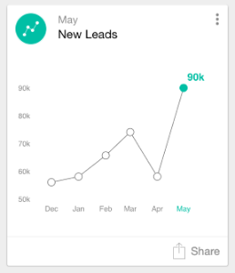

# Grundlagen zu Analytics-Karten {#understanding-analytics-cards}

Zu Beginn eines jeden Monats bietet Marketo Moments drei verschiedene Berichtskarten: &quot;Akquirierte Leads&quot;, &quot;Neue Leads&quot;und &quot;Abmeldungen&quot;. Jedes zeigt Ihnen die monatliche Performance und den Trend über einen Zeitraum von sechs Monaten.

>[!IMPORTANT]
>
>Am 2. Oktober 2023 hat Adobe die Marketo Moments-App aus allen App Stores entfernt. Wenn Sie die App bereits auf Ihrem Tablet/Mobilgerät installiert haben, können Sie sie vorerst weiter verwenden. Sobald Ihre Marketo Engage-Instanz zur Authentifizierung von Marketo zu Adobe Identity migriert wurde, können Sie nicht mehr auf die App zugreifen. [Weitere Informationen](https://nation.marketo.com/t5/product-discussions/marketo-events-app-and-marketo-moments-app-end-of-life/m-p/340712/highlight/true#M193869){target="_blank"}.

## Analytics-Karten {#analytics-cards}

Wenn Sie auf eine Analytics-Karte tippen, haben Sie folgende Möglichkeiten:

* [Als Favoriten festlegen](/help/marketo/product-docs/core-marketo-concepts/mobile-apps/marketo-moments/working-with-moments/creating-a-favorite.md)
* [Markieren Sie es wie fertig](/help/marketo/product-docs/core-marketo-concepts/mobile-apps/marketo-moments/working-with-moments/marking-it-done.md)
* [Freigeben](/help/marketo/product-docs/core-marketo-concepts/mobile-apps/marketo-moments/working-with-moments/sharing-a-moment.md)

Tippen Sie auf eine Analytics-Karte, um Folgendes anzuzeigen:

* Ein Diagramm für die Ergebnisse der letzten sechs Monate
* Monatsvergleich
* Ein Balkendiagramm der drei höchsten oder obersten Werte (je nach Karte)

Sehen wir uns beispielsweise die Details für die Analytics-Karte &quot;Akquired Leads&quot;an:

In diesem Beispiel zeigt rot an, dass der Wert im ausgewählten Datumsbereich gesunken ist (uh oh!). Grün zeigt an, dass der Wert erhöht wurde (yay!).

## Erworbene Leads {#acquired-leads}

Die **Erworbene Leads** -Karte zeigt Ihnen einen Trend-Monatsbericht zur Anzahl neuer Leads.

>[!NOTE]
>
>Nur Leads mit einem definierten Akquiseprogramm sind sichtbar.

## Neue Leads {#new-leads}

Die **Neue Leads** zeigt Ihnen einen Trend-Monatsbericht zur Gesamtanzahl neuer Leads in Ihrer Instanz in den letzten sechs Monaten.

## Abbestellungen {#unsubscribes}

Die **Abmeldungen** zeigt Ihnen einen monatlichen Trendbericht über Ihre Abmelderate in den letzten sechs Monaten.

Jetzt weißt du es.

>[!MORELIKETHIS]
>
>* [Grundlagen zu Marketo-Momenten](/help/marketo/product-docs/core-marketo-concepts/mobile-apps/marketo-moments/understanding-moments/understanding-marketo-moments.md)
>* [Grundlagen zu Ereigniskarten](/help/marketo/product-docs/core-marketo-concepts/mobile-apps/marketo-moments/understanding-moments/understanding-event-cards.md)
>* [Grundlagen zu E-Mail-Programmkarten](/help/marketo/product-docs/core-marketo-concepts/mobile-apps/marketo-moments/understanding-moments/understanding-email-program-cards.md)
