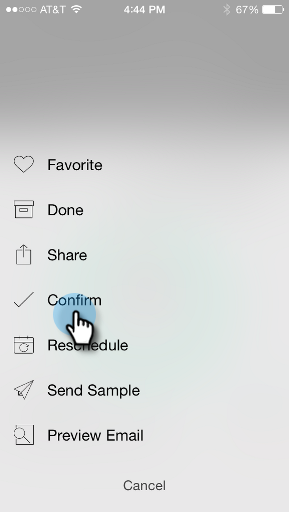

# Grundlagen zu E-Mail-Programmkarten {#understanding-email-program-cards}

Verwenden Sie Marketo Moments , um Ihre E-Mail-Programme von Ihrem Telefon oder iPad aus anzuzeigen.

>[!IMPORTANT]
>
>Am 2. Oktober 2023 hat Adobe die Marketo Moments-App aus allen App Stores entfernt. Wenn Sie die App bereits auf Ihrem Tablet/Mobilgerät installiert haben, können Sie sie vorerst weiter verwenden. Sobald Ihre Marketo Engage-Instanz zur Authentifizierung von Marketo zu Adobe Identity migriert wurde, können Sie nicht mehr auf die App zugreifen. [Weitere Informationen](https://nation.marketo.com/t5/product-discussions/marketo-events-app-and-marketo-moments-app-end-of-life/m-p/340712/highlight/true#M193869){target="_blank"}.

## E-Mail-Programmkarten {#email-program-cards}

Wenn Sie auf eine E-Mail-Programmkarte tippen, haben Sie folgende Möglichkeiten:

* [Eine E-Mail zum Favoriten machen](/help/marketo/product-docs/core-marketo-concepts/mobile-apps/marketo-moments/working-with-moments/creating-a-favorite.md)
* [E-Mail markieren wie erledigt](/help/marketo/product-docs/core-marketo-concepts/mobile-apps/marketo-moments/working-with-moments/marking-it-done.md)
* [Freigeben einer E-Mail-Momentkarte](/help/marketo/product-docs/core-marketo-concepts/mobile-apps/marketo-moments/working-with-moments/sharing-a-moment.md)

Auf einer E-Mail-Programmkarte für eine E-Mail, die noch nicht gesendet wurde, finden Sie Informationen zum Status und zur Audience des E-Mail-Programms.

Nach dem Versand der E-Mail zeigt die Karte weitere wertvolle Informationen an, darunter die Anzahl der zugestellten E-Mails, die Aktionen der Empfänger und einen Link zur in der Kampagne verwendeten Smart-Liste.

## E-Mail-Karte bestätigen {#confirming-an-email-card}

1. Um eine nicht bestätigte E-Mail-Karte zu bestätigen, tippen Sie auf das Menü mit den drei Punkten.

   

1. Tippen **[!UICONTROL Bestätigen]**.

   

1. Tippen **[!UICONTROL Bestätigen]** , um den Auftrag abzuschließen, oder **[!UICONTROL Niemals Mind]** wenn du noch nachdenklich bist.

   

   >[!NOTE]
   >
   >Jetzt wird Ihre Karte in Orange umgestellt!

## Abbrechen des Versands einer E-Mail-Karte {#canceling-an-email-card-send}

1. Wenn Sie sich entscheiden, Ihre bestätigte E-Mail nicht zu senden, tippen Sie auf das Menü mit den drei Punkten.

   

1. Tippen **[!UICONTROL Abbrechen von Senden]**.

   

## E-Mail-Karte neu planen {#rescheduling-an-email-card}

Sie können bestätigte oder nicht bestätigte E-Mail-Karten neu planen.

>[!NOTE]
>
>Für bereits bestätigte E-Mails müssen Sie die E-Mail zuerst abbrechen (siehe unten).

1. Um eine E-Mail neu zu planen, tippen Sie auf das Menü mit den drei Punkten .

   

1. Tippen **[!UICONTROL Zeitplan]**.

   

1. Datum im Kalender auswählen und tippen **[!UICONTROL Zeitplan]**.

   

   Solange Sie über einen drahtlosen Service verfügen, können Sie von überall aus einen anderen Termin vereinbaren!

## Senden eines Beispiels {#sending-a-sample}

Sie können ein Beispiel für einen E-Mail-Moment direkt mit jemandem teilen.

1. Öffnen Sie das Kartenmenü.

   

1. Tippen **[!UICONTROL Beispiel senden]**.

   

1. Geben Sie eine E-Mail-Adresse ein und klicken Sie auf **[!UICONTROL Beispiel senden]**.

   

## E-Mail-Vorschau {#previewing-an-email}

Klicken Sie mit der rechten Maustaste auf eine E-Mail-Karte, um sie in der Vorschau anzuzeigen.

1. Tippen **[!UICONTROL Vorschau von E-Mail]**.

   

   Auf diese Weise wissen Sie, dass Ihre E-Mail perfekt ist, bevor Sie den Trigger ziehen!

   

>[!MORELIKETHIS]
>
>* [Grundlagen zu Marketo-Momenten](/help/marketo/product-docs/core-marketo-concepts/mobile-apps/marketo-moments/understanding-moments/understanding-marketo-moments.md)
>* [Grundlagen zu Ereigniskarten](/help/marketo/product-docs/core-marketo-concepts/mobile-apps/marketo-moments/understanding-moments/understanding-event-cards.md)
>* [Grundlagen zu Analytics-Karten](/help/marketo/product-docs/core-marketo-concepts/mobile-apps/marketo-moments/understanding-moments/understanding-analytics-cards.md)
