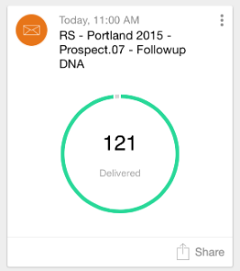
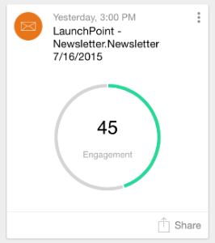
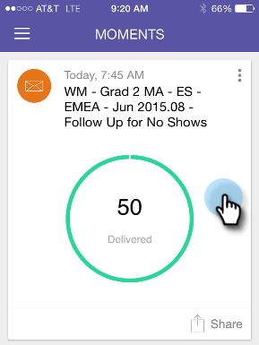
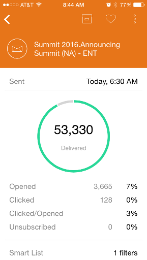
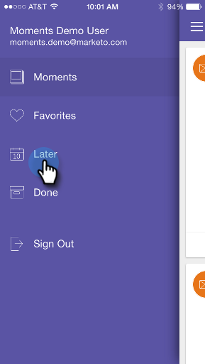
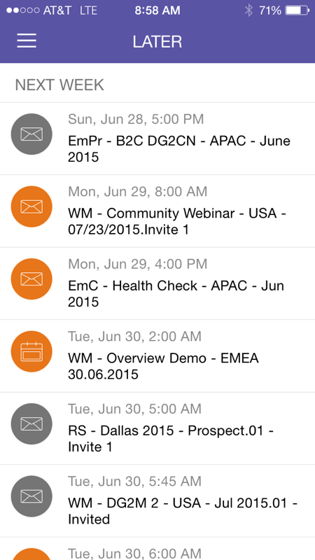
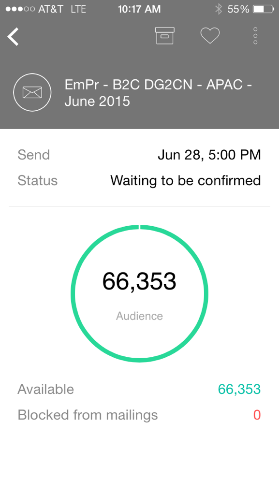
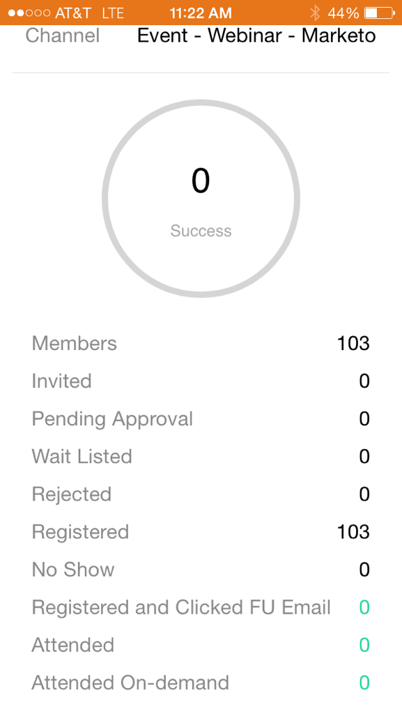
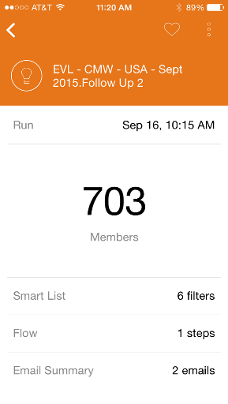
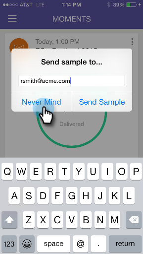

# Grundlegendes zu Marketo Moments {#understanding-marketo-moments}

Jetzt liegt die Macht von Marketo in Ihren Händen. Vorschau und Neuplanung von E-Mails direkt von Ihrem Smartphone oder iPad aus.

>[!IMPORTANT]
>
>Am 2. Oktober 2023 hat Adobe die Marketo Moments-App aus allen App Stores entfernt. Wenn Sie die App bereits auf Ihrem Tablet/Mobilgerät installiert haben, können Sie sie vorerst weiter verwenden. Nachdem Ihre Marketo Engage-Instanz zur Authentifizierung von Marketo zu Adobe Identity migriert wurde, können Sie nicht mehr auf die App zugreifen. [Weitere Informationen](https://nation.marketo.com/t5/product-discussions/marketo-events-app-and-marketo-moments-app-end-of-life/m-p/340712/highlight/true#M193869){target="_blank"}.

>[!NOTE]
>
>_Zugriff auf mobile_&quot; ist erforderlich. Wenden Sie sich an Ihren Marketo-Administrator[ um Ihre Rolle zu ](/help/marketo/product-docs/administration/users-and-roles/managing-user-roles-and-permissions.md).

## Streams {#streams}

Hier sind die verschiedenen Ströme in Momenten.

>[!NOTE]
>
>**Definition**
>
>* [!UICONTROL Moments]: Alles, was gerade lief oder gleich laufen wird, geht hier los.
>* [!UICONTROL Favoriten]: Alles, was man als Favorit markiert, geht hier rein.
>* [!UICONTROL Später]: Alles, was später als dieser Moment stattfindet, geht hier rein.
>* [!UICONTROL Fertig]: Alles, was ausgeführt oder als erledigt markiert wurde, ist hier aufgeführt.

Hier ist ein Blick auf Marketo Moments auf einem Handy.

## Drei Arten von Karten {#three-kinds-of-cards}

Marketo Moments bietet Ihnen drei verschiedene Karten, um den Fortschritt Ihrer E-Mail zu verfolgen:

**[!UICONTROL On-Deck]** - Diese E-Mail ist im Begriff, zu verschicken. Dies ist Ihre letzte Chance, eine Vorschau anzuzeigen, eine Probe zu senden oder sie sogar abzubrechen, wenn Sie es müssen.

**[!UICONTROL Heart-beat]** - Diese E-Mail wird jetzt zugestellt, einschließlich Statistiken. Teilen Sie es mit Ihrem Team.

**[!UICONTROL Ergebnisse]** - Zeigt, wie die E-Mail ausgeführt wurde. Nachdem die E-Mail ausgeführt wurde, zeigt die Karte Ergebnisse den Interaktionswert und andere Statistiken an.

## Moments Stream {#moments-stream}

Wenn Sie die App zum ersten Mal öffnen oder **[!UICONTROL Momente]** im Menü tippen, werden zuerst die entsprechenden Karten angezeigt. Jede dieser Initiativen enthält Informationen über diese spezifische Marketing-Initiative und ihre Gesamtleistung.

Durch Tippen auf die Karte wird ein Detailbildschirm geöffnet.

>[!NOTE]
>
>Orange Karten werden bestätigt, graue Karten sind provisorisch.

Durch Tippen auf die drei Punkte wird ein Kartenaktionsmenü geöffnet.

Tippen Sie auf einen der folgenden Punkte, um eine Aktion durchzuführen:

>[!NOTE]
>
>**Definition**
>
>* [!UICONTROL Favorit]: Es ist einfach, auf die Elemente zu achten, die am aktuellsten und wichtigsten sind, wenn Sie sie zu Favoriten machen.
>* [!UICONTROL Fertig]: Fertig holt es von Ihrer Marketo Moments-Ansicht (lässt es aber in Marketo, sicher und solide).
>* [!UICONTROL Freigeben]: Senden Sie ein Bild, um Ihr Team zu motivieren oder zu beglückwünschen.
>* [!UICONTROL Beispiel senden] (nur E-Mail): Hiermit können andere das Aussehen Ihrer E-Mails überprüfen, bevor Sie sie versenden.
>* [!UICONTROL Vorschau der E]Mail (nur E-Mails): Es ist immer empfehlenswert, Ihre E-Mails im Voraus zu überprüfen.

## Spätere Momente {#later-moments}

Im Abschnitt Letzter werden bevorstehende Aktivitäten angezeigt.

1. Tippen Sie zunächst auf das Menü „Hamburger“.

   

1. Tippen Sie auf **[!UICONTROL Später]**.

   

   Siehe eine Liste der bevorstehenden Aktivitäten.

   

## E-Mail-Programmkarten {#email-program-cards}

E-Mail-Programmkarten zeigen wichtige Details wie Zeitplan, Zielgruppe, Status und andere nützliche Informationen an, auch wenn Sie zu Mittag essen.

## Ereigniskarten {#event-cards}

Bei Ereignissen zeigt die Karte die Gesamtzahl der Mitglieder und ihren Status an.

## Analytics-Karten {#analytics-cards}

Auf Analytics-Momentkarten wird angezeigt, wie Ihre E-Mails und Ereignisse in den letzten sechs Monaten monatlich abgeschnitten haben, zum Beispiel:

1. Erworbene Leads
1. New Leads
1. Abbestellungen

## Smart Campaign - ausgeführte Karten {#smart-campaign-run-cards}

Smart-Campaign-Karten stellen eine einzelne Ausführung einer Kampagne dar. Bei jeder Ausführung der Smart-Kampagne wird eine neue Karte angezeigt. Tippen Sie, um die verwendeten Filter der Smart-Liste, den Kampagnenfluss und die einzelnen in der Kampagne verwendeten E-Mails anzuzeigen.

## Bestätigen oder Abbrechen einer Aktion {#confirm-or-cancel-an-action}

Bei jedem Schritt können Sie eine Aktion bestätigen oder abbrechen. Wenn Sie Ihre Meinung ändern, tippen Sie auf **[!UICONTROL Never Mind]**.

## Unterstützte Versionen {#supported-versions}

Marketo Moments unterstützt die folgenden Betriebssystemversionen:

* [!DNL Apple] iOS 8.0 und höher.
* [!DNL Android] Version 4.1 und höher.

>[!MORELIKETHIS]
>
>* [Grundlegendes zu E-Mail-Programmkarten](/help/marketo/product-docs/core-marketo-concepts/mobile-apps/marketo-moments/understanding-moments/understanding-email-program-cards.md)
>* [Grundlegendes zu Ereigniskarten](/help/marketo/product-docs/core-marketo-concepts/mobile-apps/marketo-moments/understanding-moments/understanding-event-cards.md)
>* [Analytics-Karten](/help/marketo/product-docs/core-marketo-concepts/mobile-apps/marketo-moments/understanding-moments/understanding-analytics-cards.md)
>* [Grundlegendes zu Smart Campaign-Karten](/help/marketo/product-docs/core-marketo-concepts/mobile-apps/marketo-moments/understanding-moments/understanding-smart-campaign-cards.md)
