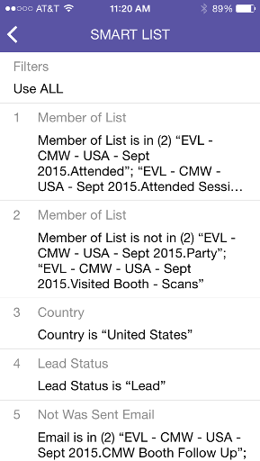
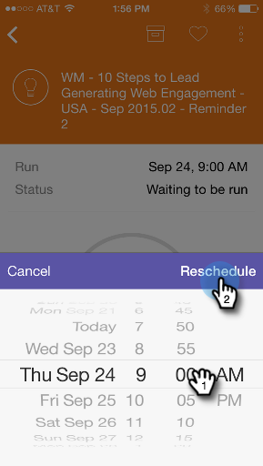

# Grundlegendes zu Smart Campaign-Karten {#understanding-smart-campaign-cards}

Verwenden Sie Marketo Moments , um jede Ausführung Ihrer Smart-Kampagnen von Ihrem Smartphone oder iPad aus anzuzeigen. Die Smart Campaign-Karte &quot;Marketo Moments“ stellt einen einzelnen Durchgang einer Kampagne dar. Bei jeder Ausführung einer Smart Campaign wird eine neue Karte angezeigt. Smart-Campaign-Karten sind oben links mit einer Glühbirne gekennzeichnet.

>[!IMPORTANT]
>
>Am 2. Oktober 2023 entfernte Adobe die Marketo Moments-App aus allen App Stores. Wenn Sie die App bereits auf Ihrem Tablet/Mobilgerät installiert haben, können Sie sie vorerst weiter verwenden. Nachdem Ihre Marketo Engage-Instanz zur Authentifizierung von Marketo auf Adobe Identity migriert wurde, können Sie nicht mehr auf die App zugreifen. [Weitere Informationen](https://nation.marketo.com/t5/product-discussions/marketo-events-app-and-marketo-moments-app-end-of-life/m-p/340712/highlight/true#M193869){target="_blank"}.

Für zukünftige Smart-Kampagnen, die geplant sind, aber noch nicht ausgeführt wurden, zeigt die Marketo Moments -Karte noch keine Kampagnenstatistiken an. Sie werden in einer zukünftigen Version erscheinen.

## Smart Campaign-Karten {#smart-campaign-cards}

1. Tippen Sie auf die Karte, um die Detailkarte zu öffnen.

   

1. Die Detailkarte bietet Zugriff auf Informationen zu den Filtern der Smart-Liste, zum Fluss und zur E-Mail-Zusammenfassung.

1. Tippen Sie auf **Smart-Liste**.

   

1. Die von der Smart-Liste verwendeten Filter werden hier angezeigt.

   

1. Tippen Sie auf **Fluss**.

   

1. Jetzt sehen Sie den Fluss der intelligenten Kampagne. Diese Kampagne hat nur einen Flussschritt, aber es kann mehrere geben.

   

1. Klicken Sie auf **E-Mail-Zusammenfassung**.

   

1. Jetzt können Sie die Empfängerantwort auf jede E-Mail nach Anzahl und Prozentsatz sehen.

   

1. Sehen Sie die beiden Punkte unten? Sie geben an, dass mit dieser Smart Campaign zwei E-Mails verbunden sind. Um Ergebnisse für die andere E-Mail anzuzeigen, wischen Sie den Bildschirm nach links. Hier finden Sie die Ergebnisse der zweiten E-Mail.

   

   >[!NOTE]
   >
   >Der andere Punkt ist jetzt hervorgehoben.

## Erstellen von E-Mail-Beispielen und Vorschauen {#creating-email-samples-and-previews}

Es empfiehlt sich, erst einen Blick auf eine E-Mail zu werfen, bevor sie verschickt wird. Oder senden Sie eine Probe an jemand anderen, um sie einem zweiten Blickwinkel zu unterziehen.

1. Tippen Sie auf das Drei-Punkte-Aktionsmenü in einer E-Mail.

   

1. Tippen Sie auf [Beispiel senden](/help/marketo/product-docs/core-marketo-concepts/mobile-apps/marketo-moments/working-with-moments/sending-a-sample.md) oder [E-Mail-Vorschau](/help/marketo/product-docs/core-marketo-concepts/mobile-apps/marketo-moments/working-with-moments/previewing-an-email.md) (klicken Sie auf diese Links, um weitere Details anzuzeigen).

   

## Bestätigen der Ausführung einer intelligenten Kampagne {#confirming-a-smart-campaign-run}

Karten für nicht bestätigte Smart-Kampagnen sind grau, bis Sie sie bestätigen. Dann werden sie orange.

1. Um eine unbestätigte Smart-Campaign-Karte zu bestätigen, tippen Sie auf das Drei-Punkte-Aktionsmenü.

   

1. Tippen Sie auf **Bestätigen**.

   

1. Tippen Sie **Bestätigen**, um den Vorgang abzuschließen, oder **Macht nichts** wenn Sie Zweifel haben.

   

   >[!NOTE]
   >
   >Jetzt wird Ihre Karte orange!

## Abbrechen der Ausführung einer intelligenten Kampagne {#canceling-a-smart-campaign-run}

Sie können eine bestätigte, geplante Ausführung einer intelligenten Kampagne abbrechen.

1. Tippen Sie auf das Drei-Punkte-Aktionsmenü.

   

1. Tippen Sie auf **Ausführung abbrechen**.

   

1. Tippen Sie auf **Ausführung abbrechen**. Wenn Sie sich in letzter Minute entscheiden, den Lauf nicht abzubrechen, tippen Sie auf **Macht nichts** und die intelligente Kampagne wird wie geplant ausgeführt.

   

## Neuplanen einer intelligenten Kampagne {#rescheduling-a-smart-campaign}

Sie können eine bestätigte intelligente Kampagne, die noch nicht ausgeführt wurde, neu planen.

1. Tippen Sie auf das Drei-Punkte-Aktionsmenü.

   

1. Tippen Sie auf **Neu planen**.

   

1. Wählen Sie ein Datum im Kalender aus und tippen Sie auf **Neu**.

   

   Ein Stück Kuchen!

## Andere Smart-Campaign-Aktionen {#other-smart-campaign-actions}

Wie bei anderen Marketo Moments -Karten können Sie auf die drei Punkte einer beliebigen Smart Campaign-Karte oder Detailkarte tippen, um Folgendes zu tun:

* [Zu einem Favoriten machen](/help/marketo/product-docs/core-marketo-concepts/mobile-apps/marketo-moments/working-with-moments/creating-a-favorite.md)
* [Als erledigt markieren](/help/marketo/product-docs/core-marketo-concepts/mobile-apps/marketo-moments/working-with-moments/marking-it-done.md)
* [Freigeben](/help/marketo/product-docs/core-marketo-concepts/mobile-apps/marketo-moments/working-with-moments/sharing-a-moment.md)

>[!NOTE]
>
>Sie können auch auf das Symbol **Freigeben** auf einer Smart-Campaign-Karte tippen, um es freizugeben, und auf die Symbole **Fertig** und **Favorit** auf der Detailkarte.

## Schnelles Löschen einer Smart Campaign-Karte {#quickly-delete-a-smart-campaign-card}

Wenn Sie eine Karte haben, die Sie nicht mehr benötigen, vielleicht eine, die Sie zum Testen verwendet haben, können Sie sie mit einem schnellen Wischen nach links oder rechts loswerden.
