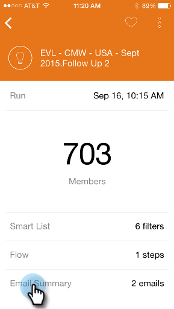

# Smart-Campaign-Karten {#understanding-smart-campaign-cards}

Verwenden Sie Marketo-Momente , um die einzelnen Ausführungen Ihrer Smart-Kampagnen von Ihrem Smartphone oder iPad aus anzuzeigen. Die Karte Marketo Moments Smart Campaign stellt einen einmaligen Kampagnenstart dar. Bei jeder Ausführung der Smart-Kampagne wird eine neue Karte angezeigt. Smart-Campaign-Karten werden links oben mit einer Glühbirne markiert.

>[!IMPORTANT]
>
>Am 2. Oktober 2023 hat Adobe die Marketo Moments-App aus allen App Stores entfernt. Wenn Sie die App bereits auf Ihrem Tablet/Mobilgerät installiert haben, können Sie sie vorerst weiter verwenden. Sobald Ihre Marketo Engage-Instanz zur Authentifizierung von Marketo zu Adobe Identity migriert wurde, können Sie nicht mehr auf die App zugreifen. [Weitere Infos](https://nation.marketo.com/t5/product-discussions/marketo-events-app-and-marketo-moments-app-end-of-life/m-p/340712/highlight/true#M193869){target="_blank"}.

Für zukünftige Smart-Kampagnen, die geplant, aber noch nicht ausgeführt werden, zeigt die Marketo-Karte Momente noch keine Kampagnenstatistiken an. Sie werden in einer zukünftigen Version erscheinen.

## Smart-Campaign-Karten {#smart-campaign-cards}

1. Tippen Sie auf die Karte, um die Detailkarte zu öffnen.

   

1. Über die Detailkarte erhalten Sie Zugriff auf Informationen zu den Smart-List-Filtern, Fluss und E-Mail-Zusammenfassung.

1. Tippen Sie auf **Smart List**.

   

1. Die von der Smart-Liste verwendeten Filter werden hier angezeigt.

   

1. Tippen Sie auf **Fluss**.

   

1. Jetzt sehen Sie den Fluss der Smart-Kampagne. Diese Kampagne hat nur einen Flussschritt, aber es kann mehrere sein.

   

1. Klicken Sie auf **E-Mail-Zusammenfassung**.

   

1. Jetzt können Sie die Antwort der Empfänger auf jede E-Mail nach Anzahl und Prozentsatz sehen.

   

1. Sehen Sie diese beiden Punkte unten? Sie weisen darauf hin, dass mit dieser Smart-Kampagne zwei E-Mails verbunden sind. Um Ergebnisse für die andere E-Mail anzuzeigen, wischen Sie den Bildschirm nach links. Hier finden Sie die Ergebnisse für die zweite E-Mail.

   

   >[!NOTE]
   >
   >Beachten Sie, dass der andere Punkt jetzt hervorgehoben wird.

## Erstellen von E-Mail-Beispielen und -Vorschau {#creating-email-samples-and-previews}

Es ist eine gute Idee, sich eine E-Mail anzusehen, bevor sie ausgeht. Oder senden Sie ein Beispiel an eine andere Person, um eine zweite Reihe von Augen darauf zu erhalten.

1. Tippen Sie auf das Aktionsmenü mit drei Punkten in einer E-Mail.

   

1. Tippen Sie auf [Beispiel senden](/help/marketo/product-docs/core-marketo-concepts/mobile-apps/marketo-moments/working-with-moments/sending-a-sample.md) oder [E-Mail-Vorschau anzeigen](/help/marketo/product-docs/core-marketo-concepts/mobile-apps/marketo-moments/working-with-moments/previewing-an-email.md) (klicken Sie für Details auf diese Links).

   

## Validieren eines Smart-Campaign-Laufs {#confirming-a-smart-campaign-run}

Karten für nicht bestätigte Smart-Kampagnen sind grau, bis Sie sie bestätigen. Dann werden sie orange.

1. Um eine nicht bestätigte Smart-Campaign-Karte zu bestätigen, tippen Sie auf das Menü mit den drei Punkten für die Aktion .

   

1. Tippen Sie auf **Bestätigen**.

   

1. Tippen Sie auf **Bestätigen** , um den Auftrag abzuschließen, oder auf **Nie stören** , wenn Sie zweierlei Gedanken haben.

   

   >[!NOTE]
   >
   >Jetzt wird Ihre Karte in Orange umgestellt!

## Abbrechen eines Smart-Campaign-Laufs {#canceling-a-smart-campaign-run}

Sie können einen bestätigten, geplanten Smart-Campaign-Lauf abbrechen.

1. Tippen Sie auf das Menü mit den drei Punkten.

   

1. Tippen Sie auf **Run abbrechen**.

   

1. Tippen Sie auf **Run abbrechen**. Wenn Sie sich in letzter Minute entscheiden, den Lauf nicht abzubrechen, tippen Sie auf **Nie stören**, und die Smart-Kampagne wird wie geplant ausgeführt.

   

## Planen einer Smart-Kampagne {#rescheduling-a-smart-campaign}

Sie können eine bestätigte Smart-Kampagne, die noch nicht ausgeführt wurde, neu planen.

1. Tippen Sie auf das Menü mit den drei Punkten.

   

1. Tippen Sie auf **Neu planen**.

   

1. Wählen Sie ein Datum im Kalender aus und tippen Sie auf **Neu planen**.

   

   Kuchen!

## Andere Smart-Campaign-Aktionen {#other-smart-campaign-actions}

Wie bei anderen Marketo-Momenten-Karten können Sie auf die drei Punkte auf einer beliebigen Smart-Campaign-Karte oder einer Detailkarte tippen, um:

* [Als Favoriten festlegen](/help/marketo/product-docs/core-marketo-concepts/mobile-apps/marketo-moments/working-with-moments/creating-a-favorite.md)
* [Markieren Sie es fertig](/help/marketo/product-docs/core-marketo-concepts/mobile-apps/marketo-moments/working-with-moments/marking-it-done.md)
* [Freigeben](/help/marketo/product-docs/core-marketo-concepts/mobile-apps/marketo-moments/working-with-moments/sharing-a-moment.md)

>[!NOTE]
>
>Sie können auch auf das Symbol **Freigeben** auf einer Smart-Campaign-Karte tippen, um diese freizugeben, und auf der Detailkarte die Symbole **Fertig** und **Favorit** .

## Schnelles Löschen einer Smart-Campaign-Karte {#quickly-delete-a-smart-campaign-card}

Wenn Sie eine Karte haben, die Sie nicht mehr benötigen, vielleicht eine, die Sie zum Testen verwendet haben, können Sie sie mit einem schnellen Wischen nach links oder rechts entfernen.
