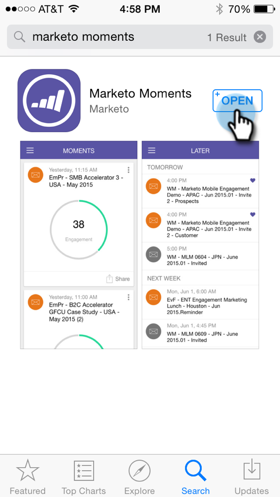
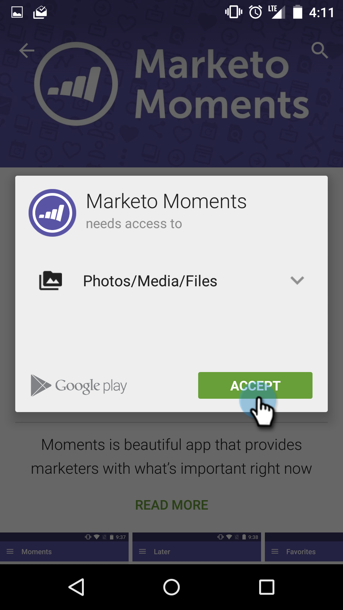

# Herunterladen von Marketing-Momenten {#downloading-marketo-moments}

Laden Sie Marketo Moments aus dem App Store oder Google Play und voila herunter! Marketo Magie in der Handfläche.

## Für iPhone {#for-iphone}

1. Gehen Sie zum [App Store](https://itunes.apple.com/us/genre/ios/id36?mt=8).\
   

1. Suchen Sie nach Marketo-Momenten und wählen Sie sie aus.\
   

1. Tippen Sie dann auf **Öffnen**.\
   

## Für Android {#for-android}

1. Gehen Sie zu [Google Play](https://play.google.com/store?hl=en).
1. Suchen Sie nach Marketo-Momenten und tippen Sie zum Herunterladen auf .\
   

1. Tippen Sie auf **Accept**.\
   

1. Tippen Sie auf **Install**.\
   

Viel Spaß!

>[!NOTE]
>
>Melden Sie sich mit Ihrem normalen Marketo-Login und -Passwort an.
>
>Single Sign-On mit Security Assertion Markup Language (SAML) wird für Marketo Moments nicht unterstützt.

>[!MORELIKETHIS]
>
>[Erläuterungen zu Markusmomenten](../../../../../product-docs/core-marketo-concepts/mobile-apps/marketo-moments/understanding-moments/understanding-marketo-moments.md)

