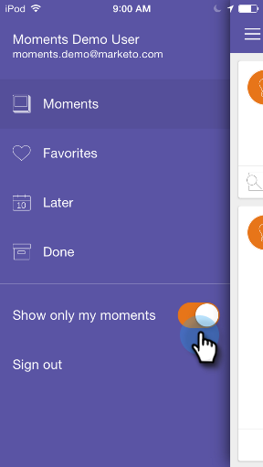

# Personalisieren von Marketo-Momenten {#personalizing-marketo-moments}

Wenn Sie viele Marketing-Programme und intelligente Kampagnen haben, ist es großartig, alles zu sehen, aber Sie können sich nur auf Ihre eigene Arbeit konzentrieren.

>[!IMPORTANT]
>
>Am 2. Oktober 2023 hat Adobe die Marketo Moments-App aus allen App Stores entfernt. Wenn Sie die App bereits auf Ihrem Tablet/Mobilgerät installiert haben, können Sie sie vorerst weiter verwenden. Sobald Ihre Marketo Engage-Instanz zur Authentifizierung von Marketo zu Adobe Identity migriert wurde, können Sie nicht mehr auf die App zugreifen. [Weitere Informationen](https://nation.marketo.com/t5/product-discussions/marketo-events-app-and-marketo-moments-app-end-of-life/m-p/340712/highlight/true#M193869){target="_blank"}.

Aktivieren **Nur meine Momente anzeigen** , um nur Ihre eigenen E-Mail-Programme und Smart-Kampagnen anzuzeigen.

Oder deaktivieren Sie **Nur meine Momente anzeigen** um alle Smart-Kampagnen und E-Mail-Programme anzuzeigen, auf die Sie Zugriff haben.

