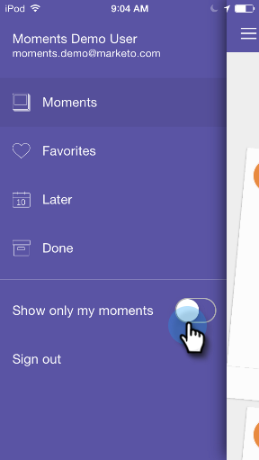

# Anpassen von Markusmomenten {#personalizing-marketo-moments}

Wenn Sie viele Marketing-Programm und intelligente Kampagnen haben, ist es toll, alles zu sehen, aber Sie sollten sich vielleicht nur auf Ihre eigene Arbeit konzentrieren.

Aktivieren Sie **Nur meine Momente** anzeigen, um nur Ihre eigenen E-Mail-Programms und intelligenten Kampagnen anzuzeigen.

Oder deaktivieren Sie **Nur meine Momente** anzeigen, um alle intelligenten Kampagnen und E-Mail-Programm, auf die Sie Zugriff haben, Ansicht.

