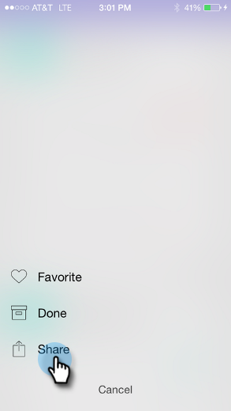

# Teilen eines Augenblicks {#sharing-a-moment}

Möchten Sie Ihr Team aktualisieren? Sie haben zwei Möglichkeiten, die Freigabe auszuwählen:

1. Tippen Sie auf **Freigeben** auf der Karte.

   

1. Tippen Sie auf das Kartenmenü und dann auf **Freigeben** auf dem Detailbildschirm.

   

   

1. Wählen Sie die Art der Freigabe aus. Lasst uns mit E-Mail gehen.

   >[!NOTE]
   >
   >Die Freigabe hängt von den auf Ihrem Telefon installierten Apps ab. Wenn Sie also nicht über Facebook verfügen, werden Sie es in Moments nicht sehen.

   

1. Geben Sie die Adresse und den Betreff des Empfängers ein und tippen Sie auf **Senden**.

   

   Großartig gemacht!
